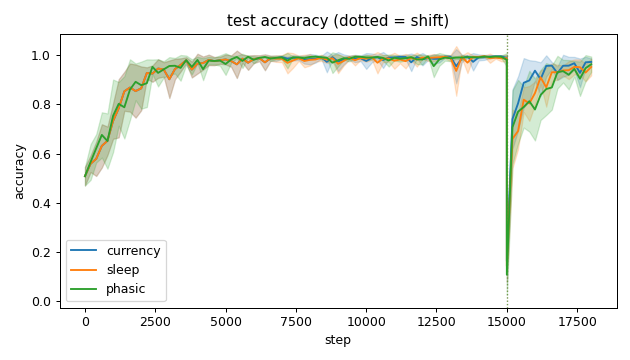
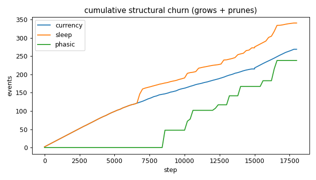
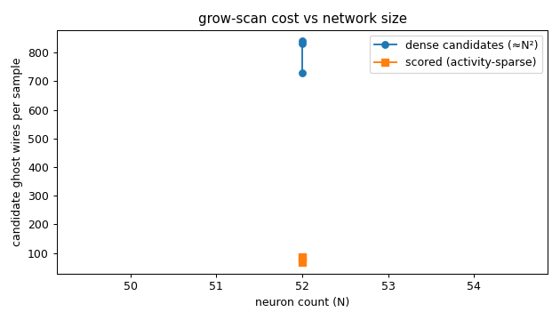
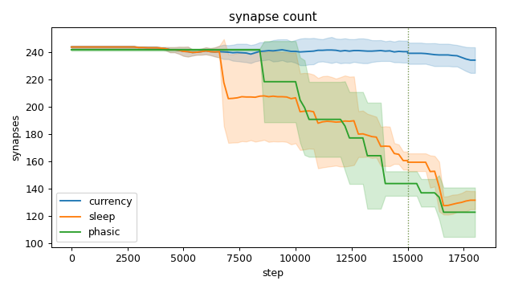
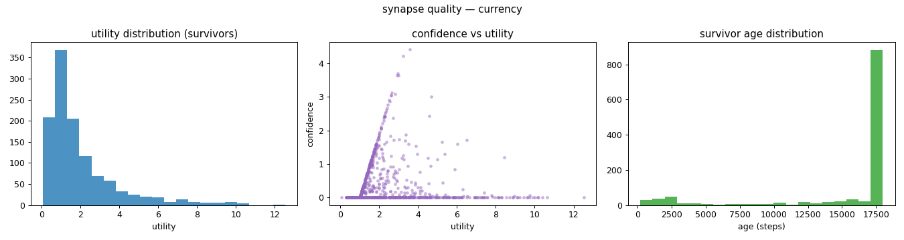
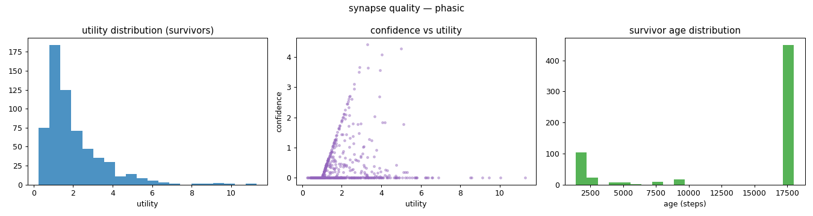
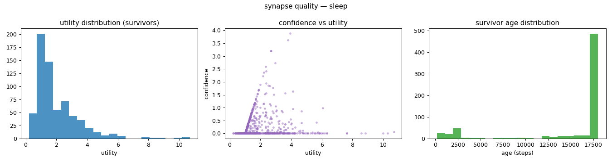
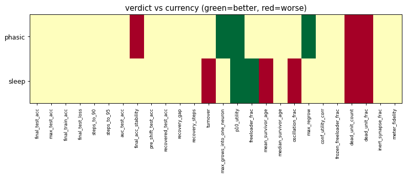

# Evaluation run: phasic-vs-continuous

- **Date:** 2026-06-06 01:49:43
- **Variants:** currency, phasic, sleep  (baseline: currency)
- **Seeds:** 5  |  **Dataset:** spirals  |  **Steps:** 15000 (+3000 shift)
- **Commit:** eb98f3c
- **Command:** `python evaluate.py --variants currency,sleep,phasic --seeds 5 --dataset spirals --steps 15000 --shift 3000 --baseline currency --jobs 6 --no-cache --publish --run-name phasic-vs-continuous`

## Key metrics

| Metric | What it means | currency (baseline) | phasic | sleep |
|---|---|---|---|---|
| final_test_acc ↑ | held-out accuracy at the end of the run | 0.973 ± 0.014 | 0.963 ± 0.031 ≈ | 0.952 ± 0.034 ≈ |
| steps_to_90 ↓ | steps to first reach 90% test accuracy | 1801 ± 606.630 | 1721 ± 587.878 ≈ | 1801 ± 606.630 ≈ |
| steps_to_95 ↓ | steps to first reach 95% test accuracy | 2481 ± 785.875 | 2681 ± 881.816 ≈ | 2481 ± 785.875 ≈ |
| auc_test_acc ↑ | area under the test-accuracy curve (speed + level) | 0.934 ± 0.021 | 0.928 ± 0.026 ≈ | 0.926 ± 0.017 ≈ |
| pre_shift_test_acc ↑ | test accuracy just before the concept shift | 0.989 ± 0.010 | 0.981 ± 0.027 ≈ | 0.988 ± 0.014 ≈ |
| recovered_test_acc ↑ | test accuracy at the end, after the label swap | 0.973 ± 0.014 | 0.963 ± 0.031 ≈ | 0.952 ± 0.034 ≈ |
| synapse_count_end | live synapses at the end | 234.400 ± 9.394 | 123 ± 18.078 ≈ | 131.800 ± 6.645 ≈ |
| effective_density | live edges as a fraction of fully-connected | 0.407 ± 0.016 | 0.214 ± 0.031 ≈ | 0.229 ± 0.012 ≈ |
| ghost_dense_cost | candidate ghost wires the grow-scan must consider (~N²) | 729.600 ± 9.394 | 841 ± 18.078 ≈ | 832.200 ± 6.645 ≈ |
| ghost_pairs_scored | candidate wires actually scored after activity+demand pruning | 85.379 ± 14.711 | 81.664 ± 15.473 ≈ | 67.157 ± 18.508 ≈ |
| mean_neuron_activation | avg hidden-neuron ReLU output on test data (neuron value) | 0.221 ± 0.031 | 0.254 ± 0.046 ≈ | 0.195 ± 0.046 ≈ |
| dead_unit_frac ↓ | fraction of hidden neurons that never fire (scale-free) | 0.092 ± 0.028 | 0.179 ± 0.049 ▼ | 0.229 ± 0.032 ▼ |
| max_grows_into_one_neuron ↓ | most times one neuron was grown into (churn) | 17.800 ± 4.956 | 13.200 ± 2.786 ▲ | 16.200 ± 1.720 ≈ |
| oscillation_frac ↓ | fraction of grown edges grown ≥2× (thrash) | 0.139 ± 0.020 | 0.063 ± 0.126 ≈ | 0.174 ± 0.013 ▼ |
| freeloader_frac ↓ | fraction of synapses below the prune-utility floor | 0.052 ± 0.035 | 0.024 ± 0.012 ≈ | 0.015 ± 0.008 ▲ |
| conf_utility_corr ↑ | corr of confidence with real utility (calibration) | 0.064 ± 0.034 | 0.099 ± 0.113 ≈ | 0.051 ± 0.058 ≈ |
| dead_unit_count ↓ | hidden neurons that never fire on test data | 4.400 ± 1.356 | 8.600 ± 2.332 ▼ | 11 ± 1.549 ▼ |

## Full scorecard

| Metric | currency (baseline) | phasic | sleep |
|---|---|---|---|
| **Prediction performance** | | | |
| final_test_acc ↑ | 0.973 ± 0.014 | 0.963 ± 0.031 ≈ | 0.952 ± 0.034 ≈ |
| max_test_acc ↑ | 0.997 ± 0.003 | 0.998 ± 0.002 ≈ | 0.998 ± 0.003 ≈ |
| final_train_acc ↑ | 0.976 ± 0.018 | 0.966 ± 0.033 ≈ | 0.950 ± 0.032 ≈ |
| final_test_loss ↓ | 0.069 ± 0.041 | 0.117 ± 0.062 ≈ | 0.152 ± 0.118 ≈ |
| **Training efficacy** | | | |
| steps_to_90 ↓ | 1801 ± 606.630 | 1721 ± 587.878 ≈ | 1801 ± 606.630 ≈ |
| steps_to_95 ↓ | 2481 ± 785.875 | 2681 ± 881.816 ≈ | 2481 ± 785.875 ≈ |
| auc_test_acc ↑ | 0.934 ± 0.021 | 0.928 ± 0.026 ≈ | 0.926 ± 0.017 ≈ |
| final_acc_stability ↓ | 0.035 ± 0.017 | 0.062 ± 0.022 ▼ | 0.037 ± 0.014 ≈ |
| pre_shift_test_acc ↑ | 0.989 ± 0.010 | 0.981 ± 0.027 ≈ | 0.988 ± 0.014 ≈ |
| recovered_test_acc ↑ | 0.973 ± 0.014 | 0.963 ± 0.031 ≈ | 0.952 ± 0.034 ≈ |
| recovery_gap ↓ | 0.016 ± 0.014 | 0.018 ± 0.049 ≈ | 0.036 ± 0.035 ≈ |
| recovery_steps ↓ | ∞ ± — | ∞ ± — ? | ∞ ± — ? |
| **Synapse structure** | | | |
| synapse_count_start | 244 ± 0.894 | 242 ± 0.894 ≈ | 244 ± 0.894 ≈ |
| synapse_count_peak | 247.800 ± 4.167 | 242 ± 0.894 ≈ | 245.800 ± 2.482 ≈ |
| synapse_count_end | 234.400 ± 9.394 | 123 ± 18.078 ≈ | 131.800 ± 6.645 ≈ |
| n_grow_events | 130.600 ± 10.911 | 59.600 ± 9.091 ≈ | 115.200 ± 10.107 ≈ |
| n_prune_events | 138.200 ± 7.909 | 178.600 ± 10.012 ≈ | 225.400 ± 13.200 ≈ |
| distinct_neurons_grown | 19.200 ± 2.786 | 13.600 ± 1.744 ≈ | 16.800 ± 2.135 ≈ |
| turnover ↓ | 1.115 ± 0.065 | 1.180 ± 0.053 ≈ | 1.684 ± 0.096 ▼ |
| max_grows_into_one_neuron ↓ | 17.800 ± 4.956 | 13.200 ± 2.786 ▲ | 16.200 ± 1.720 ≈ |
| mean_fan_in | 4.688 ± 0.188 | 2.460 ± 0.362 ≈ | 2.636 ± 0.133 ≈ |
| mean_fan_out | 4.688 ± 0.188 | 2.460 ± 0.362 ≈ | 2.636 ± 0.133 ≈ |
| effective_density | 0.407 ± 0.016 | 0.214 ± 0.031 ≈ | 0.229 ± 0.012 ≈ |
| **Synapse quality** | | | |
| p10_utility ↑ | 0.580 ± 0.050 | 0.767 ± 0.068 ▲ | 0.826 ± 0.039 ▲ |
| freeloader_frac ↓ | 0.052 ± 0.035 | 0.024 ± 0.012 ≈ | 0.015 ± 0.008 ▲ |
| mean_survivor_age ↑ | 15590 ± 226.611 | 14259 ± 1902 ≈ | 15168 ± 145.867 ▼ |
| median_survivor_age ↑ | 18000 ± 0 | 18000 ± 0 ≈ | 18000 ± 0 ≈ |
| mean_pruned_lifespan | 4976 ± 147.466 | 10985 ± 1654 ≈ | 7385 ± 627.454 ≈ |
| oscillation_frac ↓ | 0.139 ± 0.020 | 0.063 ± 0.126 ≈ | 0.174 ± 0.013 ▼ |
| max_regrow ↓ | 3.400 ± 0.490 | 0.400 ± 0.800 ▲ | 2.800 ± 0.400 ≈ |
| conf_utility_corr ↑ | 0.064 ± 0.034 | 0.099 ± 0.113 ≈ | 0.051 ± 0.058 ≈ |
| frozen_freeloader_frac ↓ | 0 ± 0 | 0 ± 0 ≈ | 0 ± 0 ≈ |
| dead_unit_count ↓ | 4.400 ± 1.356 | 8.600 ± 2.332 ▼ | 11 ± 1.549 ▼ |
| dead_unit_frac ↓ | 0.092 ± 0.028 | 0.179 ± 0.049 ▼ | 0.229 ± 0.032 ▼ |
| mean_neuron_activation | 0.221 ± 0.031 | 0.254 ± 0.046 ≈ | 0.195 ± 0.046 ≈ |
| inert_synapse_frac ↓ | 0 ± 0 | 0 ± 0 ≈ | 0 ± 0 ≈ |
| used_vs_allocated | 0.969 ± 0.037 | 0.508 ± 0.076 ≈ | 0.545 ± 0.026 ≈ |
| **Compute cost** | | | |
| ghost_dense_cost | 729.600 ± 9.394 | 841 ± 18.078 ≈ | 832.200 ± 6.645 ≈ |
| ghost_pairs_scored | 85.379 ± 14.711 | 81.664 ± 15.473 ≈ | 67.157 ± 18.508 ≈ |
| **Signal sanity** | | | |
| meter_fidelity ↑ | 0.894 ± 0.083 | 0.931 ± 0.056 ≈ | 0.930 ± 0.047 ≈ |

Baseline: **currency**. ▲ better / ▼ worse / ≈ no clear difference vs baseline (95% bootstrap CI of the mean difference). Cells show mean ± std across seeds.

## Charts

### acc_curves

### churn_curves

### cost_scaling

### count_curves

### quality_currency

### quality_phasic

### quality_sleep

### verdict_heatmap

