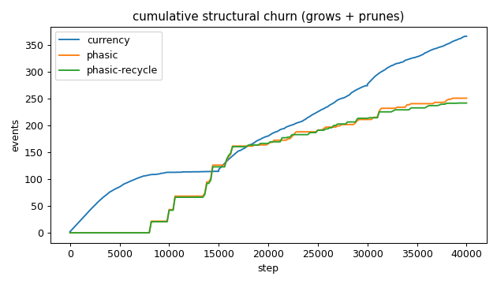
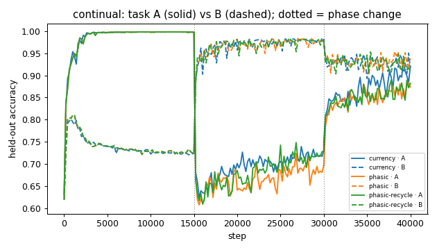
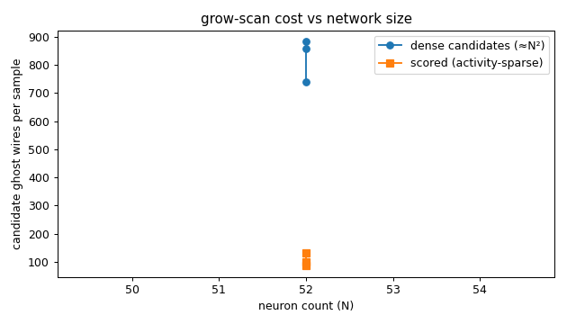
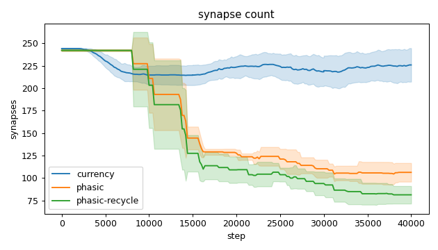
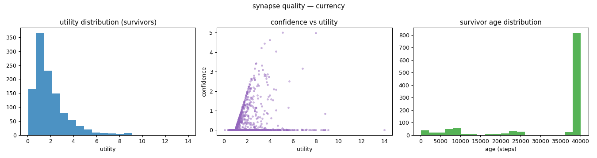
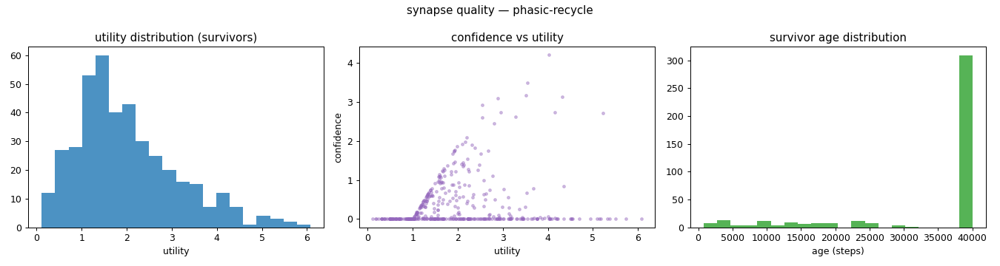
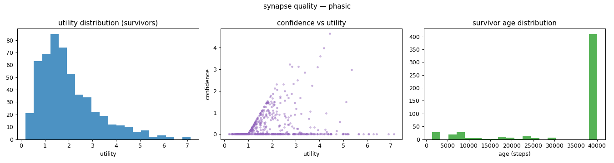
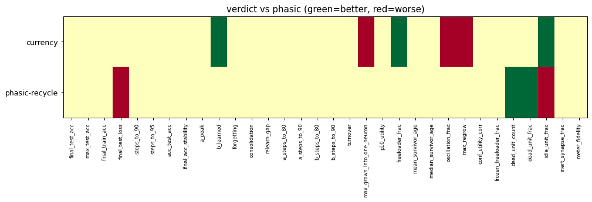

# Evaluation run: recycle-continual

- **Date:** 2026-06-11 22:48:47
- **Variants:** currency, phasic, phasic-recycle  (baseline: phasic)
- **Seeds:** 5  |  **Dataset:** spirals  |  **Steps:** 15000 (+0 shift)
- **Commit:** 2f5152f
- **Command:** `python evaluate.py --variants currency,phasic,phasic-recycle --seeds 5 --regime continual --baseline phasic --jobs 6 --no-cache --publish --run-name recycle-continual`

## Key metrics

| Metric | What it means | currency | phasic (baseline) | phasic-recycle |
|---|---|---|---|---|
| final_test_acc ↑ | held-out accuracy at the end of the run | 0.919 ± 0.018 ≈ | 0.906 ± 0.015 | 0.896 ± 0.018 ≈ |
| steps_to_90 ↓ | steps to first reach 90% test accuracy | 32681 ± 2481 ? | ∞ ± — | 32801 ± 2356 ? |
| steps_to_95 ↓ | steps to first reach 95% test accuracy | ∞ ± — ? | ∞ ± — | ∞ ± — ? |
| auc_test_acc ↑ | area under the test-accuracy curve (speed + level) | 0.860 ± 0.006 ≈ | 0.852 ± 0.012 | 0.855 ± 0.009 ≈ |
| a_peak ↑ | accuracy on task A at the end of phase A (its peak) | 0.998 ± 0.004 ≈ | 0.998 ± 0.004 | 0.998 ± 0.004 ≈ |
| a_steps_to_90 ↓ | steps into phase A to reach 90% on task A (first-task speed) | 560 ± 195.959 ≈ | 560 ± 233.238 | 560 ± 233.238 ≈ |
| b_learned ↑ | accuracy on task B at the end of phase B (forward learning) | 0.983 ± 0.005 ▲ | 0.973 ± 0.008 | 0.979 ± 0.005 ≈ |
| b_steps_to_90 ↓ | steps into phase B to reach 90% on task B (second-task speed) | 360 ± 149.666 ≈ | 320 ± 97.980 | 280 ± 97.980 ≈ |
| forgetting ↓ | task A accuracy lost while learning B (lower=better) | 0.267 ± 0.056 ≈ | 0.301 ± 0.055 | 0.270 ± 0.021 ≈ |
| consolidation ↑ | min(A, B) accuracy after interleaved A+B (holds both?) | 0.896 ± 0.024 ≈ | 0.868 ± 0.035 | 0.858 ± 0.020 ≈ |
| synapse_count_end | live synapses at the end | 225.800 ± 18.702 ≈ | 106.200 ± 10.419 | 81.200 ± 9.786 ≈ |
| effective_density | live edges as a fraction of fully-connected | 0.392 ± 0.032 ≈ | 0.184 ± 0.018 | 0.141 ± 0.017 ≈ |
| ghost_dense_cost | candidate ghost wires the grow-scan must consider (~N²) | 738.200 ± 18.702 ≈ | 857.800 ± 10.419 | 882.800 ± 9.786 ≈ |
| ghost_pairs_scored | candidate wires actually scored after activity+demand pruning | 86.769 ± 18.174 ≈ | 98.561 ± 15.843 | 131.224 ± 18.088 ≈ |
| mean_neuron_activation | avg hidden-neuron ReLU output on test data (neuron value) | 0.243 ± 0.032 ≈ | 0.254 ± 0.029 | 0.298 ± 0.036 ≈ |
| dead_unit_frac ↓ | fraction of hidden neurons that never fire (scale-free) | 0.108 ± 0.048 ≈ | 0.162 ± 0.044 | 0 ± 0 ▲ |
| idle_unit_frac ↓ | fraction of hidden neurons dead OR outputless (not in service) | 0.171 ± 0.046 ▲ | 0.338 ± 0.050 | 0.421 ± 0.075 ▼ |
| n_recycle_events | dead-unit recycles fired over the run (sleep recycling) | 0 ± 0 ≈ | 0 ± 0 | 10.200 ± 3.655 ≈ |
| recycled_rehired_frac | of recycled units, fraction back in service at the end | — ± — ? | — ± — | 0 ± 0 ? |
| max_grows_into_one_neuron ↓ | most times one neuron was grown into (churn) | 20.400 ± 3.720 ▼ | 10.200 ± 4.261 | 9.400 ± 3.499 ≈ |
| oscillation_frac ↓ | fraction of grown edges grown ≥2× (thrash) | 0.238 ± 0.044 ▼ | 0.127 ± 0.057 | 0.075 ± 0.046 ≈ |
| freeloader_frac ↓ | fraction of synapses below the prune-utility floor | 0.005 ± 0.003 ▲ | 0.032 ± 0.016 | 0.046 ± 0.032 ≈ |
| conf_utility_corr ↑ | corr of confidence with real utility (calibration) | 0.181 ± 0.089 ≈ | 0.154 ± 0.050 | 0.167 ± 0.075 ≈ |
| dead_unit_count ↓ | hidden neurons that never fire on test data | 5.200 ± 2.315 ≈ | 7.800 ± 2.135 | 0 ± 0 ▲ |

## Full scorecard

| Metric | currency | phasic (baseline) | phasic-recycle |
|---|---|---|---|
| **Prediction performance** | | | |
| final_test_acc ↑ | 0.919 ± 0.018 ≈ | 0.906 ± 0.015 | 0.896 ± 0.018 ≈ |
| max_test_acc ↑ | 0.938 ± 0.019 ≈ | 0.921 ± 0.015 | 0.914 ± 0.010 ≈ |
| final_train_acc ↑ | 0.928 ± 0.017 ≈ | 0.911 ± 0.013 | 0.902 ± 0.016 ≈ |
| final_test_loss ↓ | 0.171 ± 0.031 ≈ | 0.201 ± 0.023 | 0.231 ± 0.026 ▼ |
| **Training efficacy** | | | |
| steps_to_90 ↓ | 32681 ± 2481 ? | ∞ ± — | 32801 ± 2356 ? |
| steps_to_95 ↓ | ∞ ± — ? | ∞ ± — | ∞ ± — ? |
| auc_test_acc ↑ | 0.860 ± 0.006 ≈ | 0.852 ± 0.012 | 0.855 ± 0.009 ≈ |
| final_acc_stability ↓ | 0.015 ± 0.008 ≈ | 0.013 ± 0.005 | 0.012 ± 0.006 ≈ |
| **Continual learning** | | | |
| a_peak ↑ | 0.998 ± 0.004 ≈ | 0.998 ± 0.004 | 0.998 ± 0.004 ≈ |
| b_learned ↑ | 0.983 ± 0.005 ▲ | 0.973 ± 0.008 | 0.979 ± 0.005 ≈ |
| forgetting ↓ | 0.267 ± 0.056 ≈ | 0.301 ± 0.055 | 0.270 ± 0.021 ≈ |
| consolidation ↑ | 0.896 ± 0.024 ≈ | 0.868 ± 0.035 | 0.858 ± 0.020 ≈ |
| relearn_gap ↓ | 0.077 ± 0.044 ≈ | 0.124 ± 0.044 | 0.116 ± 0.042 ≈ |
| a_steps_to_80 ↓ | 200 ± 0 ≈ | 240 ± 80 | 240 ± 80 ≈ |
| a_steps_to_90 ↓ | 560 ± 195.959 ≈ | 560 ± 233.238 | 560 ± 233.238 ≈ |
| b_steps_to_80 ↓ | 200 ± 0 ≈ | 200 ± 0 | 200 ± 0 ≈ |
| b_steps_to_90 ↓ | 360 ± 149.666 ≈ | 320 ± 97.980 | 280 ± 97.980 ≈ |
| **Synapse structure** | | | |
| synapse_count_start | 244 ± 0.894 ≈ | 242 ± 0.894 | 242 ± 0.894 ≈ |
| synapse_count_peak | 246.200 ± 3.250 ≈ | 242 ± 0.894 | 242 ± 0.894 ≈ |
| synapse_count_end | 225.800 ± 18.702 ≈ | 106.200 ± 10.419 | 81.200 ± 9.786 ≈ |
| n_grow_events | 174.800 ± 17.781 ≈ | 57.400 ± 15.513 | 50.800 ± 11.822 ≈ |
| n_prune_events | 191 ± 15.748 ≈ | 193.200 ± 18.723 | 190.800 ± 12.007 ≈ |
| distinct_neurons_grown | 22.200 ± 3.311 ≈ | 15.200 ± 1.166 | 14.400 ± 1.020 ≈ |
| turnover ↓ | 1.644 ± 0.154 ≈ | 1.622 ± 0.264 | 1.729 ± 0.297 ≈ |
| max_grows_into_one_neuron ↓ | 20.400 ± 3.720 ▼ | 10.200 ± 4.261 | 9.400 ± 3.499 ≈ |
| mean_fan_in | 4.516 ± 0.374 ≈ | 2.124 ± 0.208 | 1.624 ± 0.196 ≈ |
| mean_fan_out | 4.516 ± 0.374 ≈ | 2.124 ± 0.208 | 1.624 ± 0.196 ≈ |
| effective_density | 0.392 ± 0.032 ≈ | 0.184 ± 0.018 | 0.141 ± 0.017 ≈ |
| **Synapse quality** | | | |
| p10_utility ↑ | 0.694 ± 0.024 ≈ | 0.740 ± 0.051 | 0.765 ± 0.135 ≈ |
| freeloader_frac ↓ | 0.005 ± 0.003 ▲ | 0.032 ± 0.016 | 0.046 ± 0.032 ≈ |
| mean_survivor_age ↑ | 32767 ± 1091 ≈ | 33564 ± 1379 | 33665 ± 760.350 ≈ |
| median_survivor_age ↑ | 40000 ± 0 ≈ | 40000 ± 0 | 40000 ± 0 ≈ |
| mean_pruned_lifespan | 8111 ± 948.464 ≈ | 14004 ± 1366 | 14018 ± 1758 ≈ |
| oscillation_frac ↓ | 0.238 ± 0.044 ▼ | 0.127 ± 0.057 | 0.075 ± 0.046 ≈ |
| max_regrow ↓ | 4.200 ± 0.748 ▼ | 1.600 ± 0.800 | 1.200 ± 0.980 ≈ |
| conf_utility_corr ↑ | 0.181 ± 0.089 ≈ | 0.154 ± 0.050 | 0.167 ± 0.075 ≈ |
| frozen_freeloader_frac ↓ | 0 ± 0 ≈ | 0 ± 0 | 0 ± 0 ≈ |
| dead_unit_count ↓ | 5.200 ± 2.315 ≈ | 7.800 ± 2.135 | 0 ± 0 ▲ |
| dead_unit_frac ↓ | 0.108 ± 0.048 ≈ | 0.162 ± 0.044 | 0 ± 0 ▲ |
| idle_unit_frac ↓ | 0.171 ± 0.046 ▲ | 0.338 ± 0.050 | 0.421 ± 0.075 ▼ |
| mean_neuron_activation | 0.243 ± 0.032 ≈ | 0.254 ± 0.029 | 0.298 ± 0.036 ≈ |
| inert_synapse_frac ↓ | 0 ± 0 ≈ | 0 ± 0 | 0 ± 0 ≈ |
| used_vs_allocated | 0.933 ± 0.074 ≈ | 0.439 ± 0.044 | 0.336 ± 0.041 ≈ |
| n_recycle_events | 0 ± 0 ≈ | 0 ± 0 | 10.200 ± 3.655 ≈ |
| recycled_rehired_frac | — ± — ? | — ± — | 0 ± 0 ? |
| **Compute cost** | | | |
| ghost_dense_cost | 738.200 ± 18.702 ≈ | 857.800 ± 10.419 | 882.800 ± 9.786 ≈ |
| ghost_pairs_scored | 86.769 ± 18.174 ≈ | 98.561 ± 15.843 | 131.224 ± 18.088 ≈ |
| **Signal sanity** | | | |
| meter_fidelity ↑ | 0.955 ± 0.021 ≈ | 0.954 ± 0.025 | 0.966 ± 0.020 ≈ |

Baseline: **phasic**. ▲ better / ▼ worse / ≈ no clear difference vs baseline (95% bootstrap CI of the mean difference). Cells show mean ± std across seeds.

## Charts

### churn_curves

### continual_curves

### cost_scaling

### count_curves

### quality_currency

### quality_phasic-recycle

### quality_phasic

### verdict_heatmap

