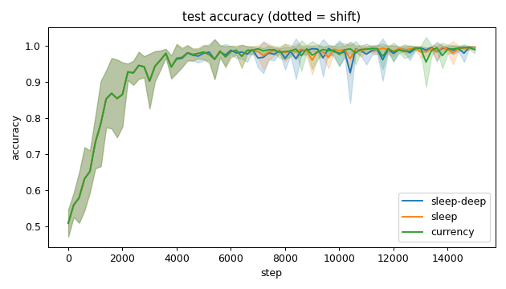
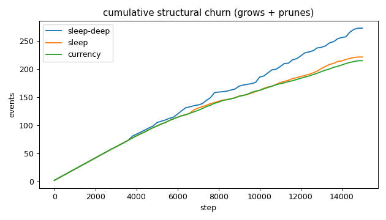
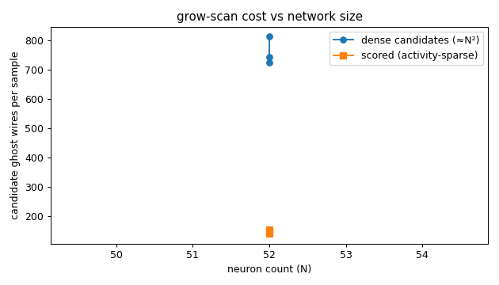
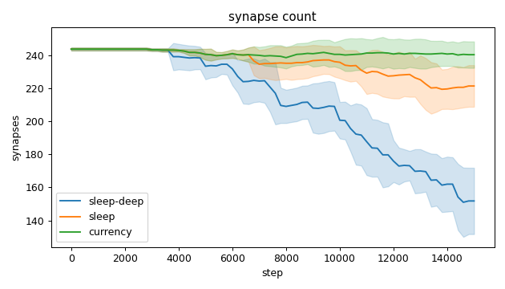
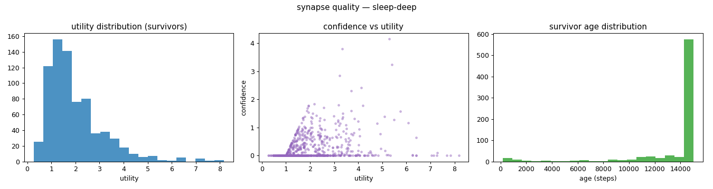
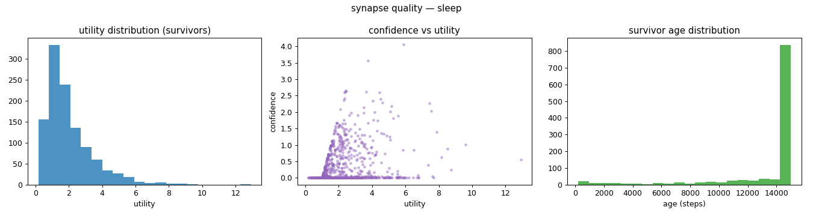
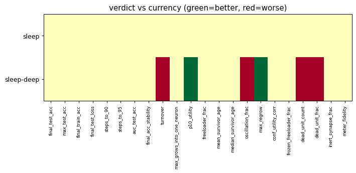

# Evaluation run: sleep-consolidation

- **Date:** 2026-06-03 07:49:21
- **Variants:** currency, sleep, sleep-deep  (baseline: currency)
- **Seeds:** 5  |  **Dataset:** spirals  |  **Steps:** 15000 (+0 shift)
- **Commit:** 7985c26
- **Command:** `python evaluate.py --variants sleep-deep,sleep,currency --seeds 5 --dataset spirals --steps 15000 --baseline currency --jobs 6 --no-cache --publish --run-name sleep-consolidation`

## Key metrics

| Metric | What it means | currency (baseline) | sleep | sleep-deep |
|---|---|---|---|---|
| final_test_acc ↑ | held-out accuracy at the end of the run | 0.989 ± 0.010 | 0.996 ± 0.003 ≈ | 0.995 ± 0.004 ≈ |
| steps_to_90 ↓ | steps to first reach 90% test accuracy | 1801 ± 606.630 | 1801 ± 606.630 ≈ | 1801 ± 606.630 ≈ |
| steps_to_95 ↓ | steps to first reach 95% test accuracy | 2481 ± 785.875 | 2481 ± 785.875 ≈ | 2481 ± 785.875 ≈ |
| auc_test_acc ↑ | area under the test-accuracy curve (speed + level) | 0.943 ± 0.018 | 0.943 ± 0.018 ≈ | 0.941 ± 0.018 ≈ |
| synapse_count_end | live synapses at the end | 240.600 ± 8.015 | 221.600 ± 12.627 ≈ | 151.800 ± 20.134 ≈ |
| effective_density | live edges as a fraction of fully-connected | 0.418 ± 0.014 | 0.385 ± 0.022 ≈ | 0.264 ± 0.035 ≈ |
| ghost_dense_cost | candidate ghost wires the grow-scan must consider (~N²) | 723.400 ± 8.015 | 742.400 ± 12.627 ≈ | 812.200 ± 20.134 ≈ |
| ghost_pairs_scored | candidate wires actually scored after activity+demand pruning | 149.784 ± 16.920 | 154.568 ± 16.961 ≈ | 141.494 ± 13.604 ≈ |
| mean_neuron_activation | avg hidden-neuron ReLU output on test data (neuron value) | 0.363 ± 0.020 | 0.368 ± 0.030 ≈ | 0.362 ± 0.017 ≈ |
| dead_unit_frac ↓ | fraction of hidden neurons that never fire (scale-free) | 0.063 ± 0.029 | 0.075 ± 0.017 ≈ | 0.142 ± 0.044 ▼ |
| max_grows_into_one_neuron ↓ | most times one neuron was grown into (churn) | 16.600 ± 5.238 | 14 ± 1.673 ≈ | 13.400 ± 2.059 ≈ |
| oscillation_frac ↓ | fraction of grown edges grown ≥2× (thrash) | 0.142 ± 0.031 | 0.149 ± 0.028 ≈ | 0.197 ± 0.034 ▼ |
| freeloader_frac ↓ | fraction of synapses below the prune-utility floor | 0.011 ± 0.017 | 0.014 ± 0.010 ≈ | 0.016 ± 0.010 ≈ |
| conf_utility_corr ↑ | corr of confidence with real utility (calibration) | 0.303 ± 0.056 | 0.312 ± 0.075 ≈ | 0.290 ± 0.102 ≈ |
| dead_unit_count ↓ | hidden neurons that never fire on test data | 3 ± 1.414 | 3.600 ± 0.800 ≈ | 6.800 ± 2.135 ▼ |

## Full scorecard

| Metric | currency (baseline) | sleep | sleep-deep |
|---|---|---|---|
| **Prediction performance** | | | |
| final_test_acc ↑ | 0.989 ± 0.010 | 0.996 ± 0.003 ≈ | 0.995 ± 0.004 ≈ |
| max_test_acc ↑ | 0.997 ± 0.003 | 0.998 ± 0.002 ≈ | 0.998 ± 0.003 ≈ |
| final_train_acc ↑ | 0.991 ± 0.011 | 0.997 ± 0.004 ≈ | 0.997 ± 0.005 ≈ |
| final_test_loss ↓ | 0.033 ± 0.030 | 0.016 ± 0.012 ≈ | 0.018 ± 0.012 ≈ |
| **Training efficacy** | | | |
| steps_to_90 ↓ | 1801 ± 606.630 | 1801 ± 606.630 ≈ | 1801 ± 606.630 ≈ |
| steps_to_95 ↓ | 2481 ± 785.875 | 2481 ± 785.875 ≈ | 2481 ± 785.875 ≈ |
| auc_test_acc ↑ | 0.943 ± 0.018 | 0.943 ± 0.018 ≈ | 0.941 ± 0.018 ≈ |
| final_acc_stability ↓ | 0.018 ± 0.020 | 0.009 ± 0.009 ≈ | 0.008 ± 0.008 ≈ |
| **Synapse structure** | | | |
| synapse_count_start | 244 ± 0.894 | 244 ± 0.894 ≈ | 244 ± 0.894 ≈ |
| synapse_count_peak | 247.800 ± 4.167 | 245.800 ± 2.482 ≈ | 244.800 ± 2.227 ≈ |
| synapse_count_end | 240.600 ± 8.015 | 221.600 ± 12.627 ≈ | 151.800 ± 20.134 ≈ |
| n_grow_events | 106.800 ± 9.847 | 100.600 ± 11.218 ≈ | 91.400 ± 5.314 ≈ |
| n_prune_events | 108.200 ± 7.909 | 121 ± 8.414 ≈ | 181.600 ± 19.825 ≈ |
| distinct_neurons_grown | 16.600 ± 3.007 | 16.600 ± 2.653 ≈ | 15.600 ± 2.577 ≈ |
| turnover ↓ | 0.889 ± 0.063 | 0.940 ± 0.061 ≈ | 1.293 ± 0.124 ▼ |
| max_grows_into_one_neuron ↓ | 16.600 ± 5.238 | 14 ± 1.673 ≈ | 13.400 ± 2.059 ≈ |
| mean_fan_in | 4.812 ± 0.160 | 4.432 ± 0.253 ≈ | 3.036 ± 0.403 ≈ |
| mean_fan_out | 4.812 ± 0.160 | 4.432 ± 0.253 ≈ | 3.036 ± 0.403 ≈ |
| effective_density | 0.418 ± 0.014 | 0.385 ± 0.022 ≈ | 0.264 ± 0.035 ≈ |
| **Synapse quality** | | | |
| p10_utility ↑ | 0.711 ± 0.059 | 0.749 ± 0.064 ≈ | 0.898 ± 0.097 ▲ |
| freeloader_frac ↓ | 0.011 ± 0.017 | 0.014 ± 0.010 ≈ | 0.016 ± 0.010 ≈ |
| mean_survivor_age ↑ | 13560 ± 214.305 | 13552 ± 109.272 ≈ | 13621 ± 252.955 ≈ |
| median_survivor_age ↑ | 15000 ± 0 | 15000 ± 0 ≈ | 15000 ± 0 ≈ |
| mean_pruned_lifespan | 3348 ± 358.192 | 4425 ± 462.134 ≈ | 6073 ± 777.696 ≈ |
| oscillation_frac ↓ | 0.142 ± 0.031 | 0.149 ± 0.028 ≈ | 0.197 ± 0.034 ▼ |
| max_regrow ↓ | 3.400 ± 0.490 | 3.200 ± 0.748 ≈ | 2.400 ± 0.490 ▲ |
| conf_utility_corr ↑ | 0.303 ± 0.056 | 0.312 ± 0.075 ≈ | 0.290 ± 0.102 ≈ |
| frozen_freeloader_frac ↓ | 0 ± 0 | 0 ± 0 ≈ | 0 ± 0 ≈ |
| dead_unit_count ↓ | 3 ± 1.414 | 3.600 ± 0.800 ≈ | 6.800 ± 2.135 ▼ |
| dead_unit_frac ↓ | 0.063 ± 0.029 | 0.075 ± 0.017 ≈ | 0.142 ± 0.044 ▼ |
| mean_neuron_activation | 0.363 ± 0.020 | 0.368 ± 0.030 ≈ | 0.362 ± 0.017 ≈ |
| inert_synapse_frac ↓ | 0 ± 0 | 0 ± 0 ≈ | 0 ± 0 ≈ |
| used_vs_allocated | 0.994 ± 0.031 | 0.916 ± 0.051 ≈ | 0.627 ± 0.083 ≈ |
| **Compute cost** | | | |
| ghost_dense_cost | 723.400 ± 8.015 | 742.400 ± 12.627 ≈ | 812.200 ± 20.134 ≈ |
| ghost_pairs_scored | 149.784 ± 16.920 | 154.568 ± 16.961 ≈ | 141.494 ± 13.604 ≈ |
| **Signal sanity** | | | |
| meter_fidelity ↑ | 0.648 ± 0.222 | 0.691 ± 0.126 ≈ | 0.804 ± 0.059 ≈ |

Baseline: **currency**. ▲ better / ▼ worse / ≈ no clear difference vs baseline (95% bootstrap CI of the mean difference). Cells show mean ± std across seeds.

## Charts

### acc_curves

### churn_curves

### cost_scaling

### count_curves

### quality_currency

### quality_sleep-deep

### quality_sleep

### verdict_heatmap

