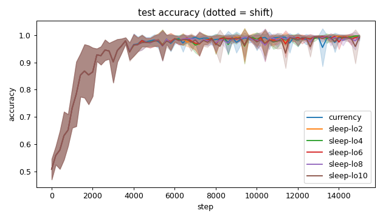
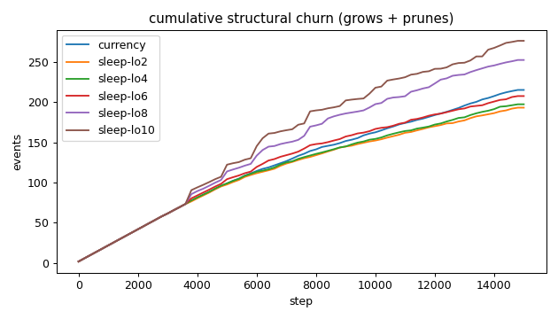
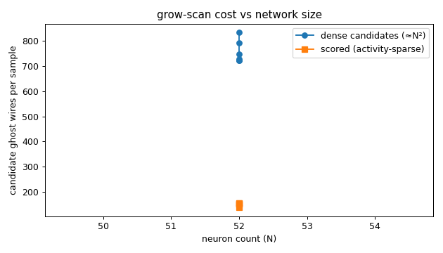
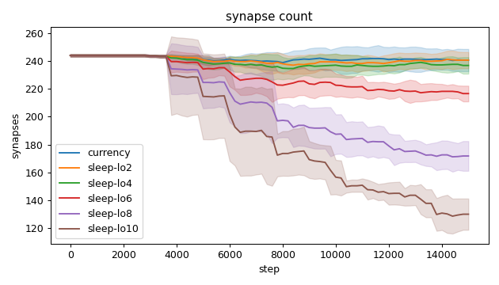
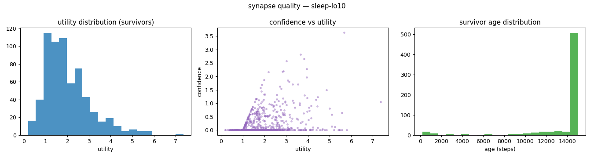
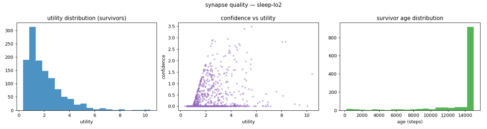
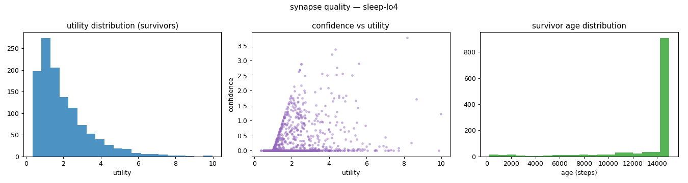
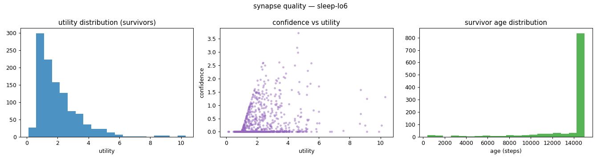
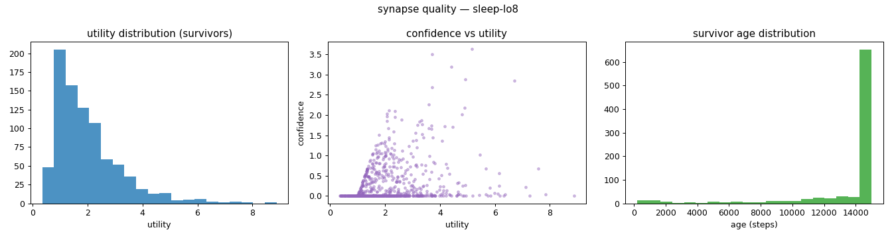
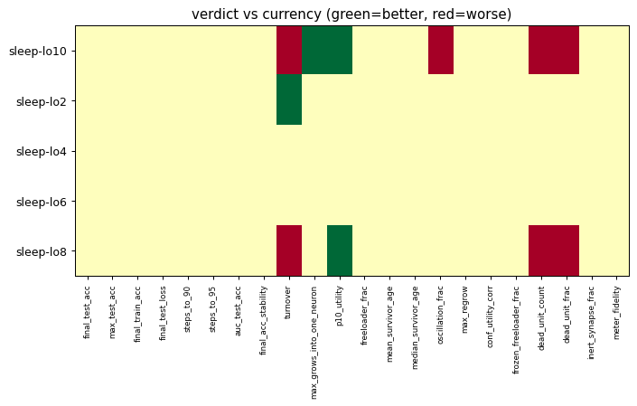

# Evaluation run: sleep-nocap-lowfloor

- **Date:** 2026-06-03 23:34:21
- **Variants:** currency, sleep-lo10, sleep-lo2, sleep-lo4, sleep-lo6, sleep-lo8  (baseline: currency)
- **Seeds:** 5  |  **Dataset:** spirals  |  **Steps:** 15000 (+0 shift)
- **Commit:** 75d2682
- **Command:** `python evaluate.py --variants currency,sleep-lo2,sleep-lo4,sleep-lo6,sleep-lo8,sleep-lo10 --seeds 5 --dataset spirals --steps 15000 --baseline currency --jobs 6 --no-cache --publish --run-name sleep-nocap-lowfloor`

## Key metrics

| Metric | What it means | currency (baseline) | sleep-lo10 | sleep-lo2 | sleep-lo4 | sleep-lo6 | sleep-lo8 |
|---|---|---|---|---|---|---|---|
| final_test_acc ↑ | held-out accuracy at the end of the run | 0.989 ± 0.010 | 0.994 ± 0.007 ≈ | 0.995 ± 0.007 ≈ | 0.997 ± 0.003 ≈ | 0.993 ± 0.009 ≈ | 0.996 ± 0.003 ≈ |
| steps_to_90 ↓ | steps to first reach 90% test accuracy | 1801 ± 606.630 | 1801 ± 606.630 ≈ | 1801 ± 606.630 ≈ | 1801 ± 606.630 ≈ | 1801 ± 606.630 ≈ | 1801 ± 606.630 ≈ |
| steps_to_95 ↓ | steps to first reach 95% test accuracy | 2481 ± 785.875 | 2481 ± 785.875 ≈ | 2481 ± 785.875 ≈ | 2481 ± 785.875 ≈ | 2481 ± 785.875 ≈ | 2481 ± 785.875 ≈ |
| auc_test_acc ↑ | area under the test-accuracy curve (speed + level) | 0.943 ± 0.018 | 0.939 ± 0.018 ≈ | 0.943 ± 0.019 ≈ | 0.942 ± 0.018 ≈ | 0.942 ± 0.019 ≈ | 0.942 ± 0.018 ≈ |
| synapse_count_end | live synapses at the end | 240.600 ± 8.015 | 130 ± 11.243 ≈ | 240.600 ± 5.783 ≈ | 236.800 ± 5.913 ≈ | 216.600 ± 5.643 ≈ | 171.800 ± 10.685 ≈ |
| effective_density | live edges as a fraction of fully-connected | 0.418 ± 0.014 | 0.226 ± 0.020 ≈ | 0.418 ± 0.010 ≈ | 0.411 ± 0.010 ≈ | 0.376 ± 0.010 ≈ | 0.298 ± 0.019 ≈ |
| ghost_dense_cost | candidate ghost wires the grow-scan must consider (~N²) | 723.400 ± 8.015 | 834 ± 11.243 ≈ | 723.400 ± 5.783 ≈ | 727.200 ± 5.913 ≈ | 747.400 ± 5.643 ≈ | 792.200 ± 10.685 ≈ |
| ghost_pairs_scored | candidate wires actually scored after activity+demand pruning | 149.784 ± 16.920 | 138.611 ± 11.037 ≈ | 156.719 ± 18.001 ≈ | 154.035 ± 11.594 ≈ | 154.760 ± 12.823 ≈ | 152.449 ± 10.415 ≈ |
| mean_neuron_activation | avg hidden-neuron ReLU output on test data (neuron value) | 0.363 ± 0.020 | 0.359 ± 0.032 ≈ | 0.366 ± 0.029 ≈ | 0.366 ± 0.026 ≈ | 0.361 ± 0.028 ≈ | 0.369 ± 0.027 ≈ |
| dead_unit_frac ↓ | fraction of hidden neurons that never fire (scale-free) | 0.063 ± 0.029 | 0.146 ± 0.029 ▼ | 0.058 ± 0.024 ≈ | 0.058 ± 0.024 ≈ | 0.071 ± 0.028 ≈ | 0.117 ± 0.021 ▼ |
| max_grows_into_one_neuron ↓ | most times one neuron was grown into (churn) | 16.600 ± 5.238 | 12.800 ± 1.327 ▲ | 14 ± 3.162 ≈ | 15.600 ± 2.800 ≈ | 13.200 ± 1.470 ≈ | 13.800 ± 1.327 ≈ |
| oscillation_frac ↓ | fraction of grown edges grown ≥2× (thrash) | 0.142 ± 0.031 | 0.183 ± 0.015 ▼ | 0.115 ± 0.034 ≈ | 0.127 ± 0.035 ≈ | 0.146 ± 0.040 ≈ | 0.157 ± 0.022 ≈ |
| freeloader_frac ↓ | fraction of synapses below the prune-utility floor | 0.011 ± 0.017 | 0.017 ± 0.005 ≈ | 0.002 ± 0.002 ≈ | 0.003 ± 0.002 ≈ | 0.004 ± 0.005 ≈ | 0.014 ± 0.013 ≈ |
| conf_utility_corr ↑ | corr of confidence with real utility (calibration) | 0.303 ± 0.056 | 0.298 ± 0.062 ≈ | 0.334 ± 0.071 ≈ | 0.289 ± 0.084 ≈ | 0.306 ± 0.075 ≈ | 0.288 ± 0.059 ≈ |
| dead_unit_count ↓ | hidden neurons that never fire on test data | 3 ± 1.414 | 7 ± 1.414 ▼ | 2.800 ± 1.166 ≈ | 2.800 ± 1.166 ≈ | 3.400 ± 1.356 ≈ | 5.600 ± 1.020 ▼ |

## Full scorecard

| Metric | currency (baseline) | sleep-lo10 | sleep-lo2 | sleep-lo4 | sleep-lo6 | sleep-lo8 |
|---|---|---|---|---|---|---|
| **Prediction performance** | | | | | | |
| final_test_acc ↑ | 0.989 ± 0.010 | 0.994 ± 0.007 ≈ | 0.995 ± 0.007 ≈ | 0.997 ± 0.003 ≈ | 0.993 ± 0.009 ≈ | 0.996 ± 0.003 ≈ |
| max_test_acc ↑ | 0.997 ± 0.003 | 0.998 ± 0.002 ≈ | 0.999 ± 0.002 ≈ | 0.999 ± 0.002 ≈ | 0.998 ± 0.002 ≈ | 0.998 ± 0.002 ≈ |
| final_train_acc ↑ | 0.991 ± 0.011 | 0.992 ± 0.009 ≈ | 0.996 ± 0.005 ≈ | 0.996 ± 0.006 ≈ | 0.995 ± 0.006 ≈ | 0.996 ± 0.005 ≈ |
| final_test_loss ↓ | 0.033 ± 0.030 | 0.027 ± 0.024 ≈ | 0.020 ± 0.020 ≈ | 0.014 ± 0.010 ≈ | 0.025 ± 0.029 ≈ | 0.014 ± 0.011 ≈ |
| **Training efficacy** | | | | | | |
| steps_to_90 ↓ | 1801 ± 606.630 | 1801 ± 606.630 ≈ | 1801 ± 606.630 ≈ | 1801 ± 606.630 ≈ | 1801 ± 606.630 ≈ | 1801 ± 606.630 ≈ |
| steps_to_95 ↓ | 2481 ± 785.875 | 2481 ± 785.875 ≈ | 2481 ± 785.875 ≈ | 2481 ± 785.875 ≈ | 2481 ± 785.875 ≈ | 2481 ± 785.875 ≈ |
| auc_test_acc ↑ | 0.943 ± 0.018 | 0.939 ± 0.018 ≈ | 0.943 ± 0.019 ≈ | 0.942 ± 0.018 ≈ | 0.942 ± 0.019 ≈ | 0.942 ± 0.018 ≈ |
| final_acc_stability ↓ | 0.018 ± 0.020 | 0.016 ± 0.018 ≈ | 0.004 ± 0.004 ≈ | 0.007 ± 0.004 ≈ | 0.009 ± 0.007 ≈ | 0.012 ± 0.009 ≈ |
| **Synapse structure** | | | | | | |
| synapse_count_start | 244 ± 0.894 | 244 ± 0.894 ≈ | 244 ± 0.894 ≈ | 244 ± 0.894 ≈ | 244 ± 0.894 ≈ | 244 ± 0.894 ≈ |
| synapse_count_peak | 247.800 ± 4.167 | 244.800 ± 2.227 ≈ | 245.200 ± 2.482 ≈ | 244.800 ± 2.227 ≈ | 244.800 ± 2.227 ≈ | 244.800 ± 2.227 ≈ |
| synapse_count_end | 240.600 ± 8.015 | 130 ± 11.243 ≈ | 240.600 ± 5.783 ≈ | 236.800 ± 5.913 ≈ | 216.600 ± 5.643 ≈ | 171.800 ± 10.685 ≈ |
| n_grow_events | 106.800 ± 9.847 | 82 ± 9.716 ≈ | 95.800 ± 6.013 ≈ | 96 ± 6.928 ≈ | 91 ± 7.014 ≈ | 91 ± 3.899 ≈ |
| n_prune_events | 108.200 ± 7.909 | 194 ± 9.940 ≈ | 97.200 ± 5.741 ≈ | 101.200 ± 8.256 ≈ | 116.400 ± 7.310 ≈ | 161.200 ± 7.139 ≈ |
| distinct_neurons_grown | 16.600 ± 3.007 | 14.600 ± 1.200 ≈ | 15.600 ± 1.497 ≈ | 15.800 ± 2.315 ≈ | 15.600 ± 2.417 ≈ | 15.400 ± 1.855 ≈ |
| turnover ↓ | 0.889 ± 0.063 | 1.463 ± 0.093 ▼ | 0.802 ± 0.044 ▲ | 0.825 ± 0.060 ≈ | 0.903 ± 0.059 ≈ | 1.215 ± 0.055 ▼ |
| max_grows_into_one_neuron ↓ | 16.600 ± 5.238 | 12.800 ± 1.327 ▲ | 14 ± 3.162 ≈ | 15.600 ± 2.800 ≈ | 13.200 ± 1.470 ≈ | 13.800 ± 1.327 ≈ |
| mean_fan_in | 4.812 ± 0.160 | 2.600 ± 0.225 ≈ | 4.812 ± 0.116 ≈ | 4.736 ± 0.118 ≈ | 4.332 ± 0.113 ≈ | 3.436 ± 0.214 ≈ |
| mean_fan_out | 4.812 ± 0.160 | 2.600 ± 0.225 ≈ | 4.812 ± 0.116 ≈ | 4.736 ± 0.118 ≈ | 4.332 ± 0.113 ≈ | 3.436 ± 0.214 ≈ |
| effective_density | 0.418 ± 0.014 | 0.226 ± 0.020 ≈ | 0.418 ± 0.010 ≈ | 0.411 ± 0.010 ≈ | 0.376 ± 0.010 ≈ | 0.298 ± 0.019 ≈ |
| **Synapse quality** | | | | | | |
| p10_utility ↑ | 0.711 ± 0.059 | 0.961 ± 0.062 ▲ | 0.712 ± 0.037 ≈ | 0.705 ± 0.042 ≈ | 0.767 ± 0.041 ≈ | 0.870 ± 0.042 ▲ |
| freeloader_frac ↓ | 0.011 ± 0.017 | 0.017 ± 0.005 ≈ | 0.002 ± 0.002 ≈ | 0.003 ± 0.002 ≈ | 0.004 ± 0.005 ≈ | 0.014 ± 0.013 ≈ |
| mean_survivor_age ↑ | 13560 ± 214.305 | 13708 ± 287.187 ≈ | 13648 ± 176.958 ≈ | 13651 ± 86.073 ≈ | 13733 ± 102.231 ≈ | 13649 ± 138.488 ≈ |
| median_survivor_age ↑ | 15000 ± 0 | 15000 ± 0 ≈ | 15000 ± 0 ≈ | 15000 ± 0 ≈ | 15000 ± 0 ≈ | 15000 ± 0 ≈ |
| mean_pruned_lifespan | 3348 ± 358.192 | 5485 ± 271.906 ≈ | 3366 ± 330.070 ≈ | 3491 ± 311.642 ≈ | 4060 ± 249.818 ≈ | 4847 ± 526.293 ≈ |
| oscillation_frac ↓ | 0.142 ± 0.031 | 0.183 ± 0.015 ▼ | 0.115 ± 0.034 ≈ | 0.127 ± 0.035 ≈ | 0.146 ± 0.040 ≈ | 0.157 ± 0.022 ≈ |
| max_regrow ↓ | 3.400 ± 0.490 | 3 ± 0.632 ≈ | 3.200 ± 1.470 ≈ | 3.200 ± 1.166 ≈ | 2.800 ± 0.748 ≈ | 3.200 ± 1.166 ≈ |
| conf_utility_corr ↑ | 0.303 ± 0.056 | 0.298 ± 0.062 ≈ | 0.334 ± 0.071 ≈ | 0.289 ± 0.084 ≈ | 0.306 ± 0.075 ≈ | 0.288 ± 0.059 ≈ |
| frozen_freeloader_frac ↓ | 0 ± 0 | 0 ± 0 ≈ | 0 ± 0 ≈ | 0 ± 0 ≈ | 0 ± 0 ≈ | 0 ± 0 ≈ |
| dead_unit_count ↓ | 3 ± 1.414 | 7 ± 1.414 ▼ | 2.800 ± 1.166 ≈ | 2.800 ± 1.166 ≈ | 3.400 ± 1.356 ≈ | 5.600 ± 1.020 ▼ |
| dead_unit_frac ↓ | 0.063 ± 0.029 | 0.146 ± 0.029 ▼ | 0.058 ± 0.024 ≈ | 0.058 ± 0.024 ≈ | 0.071 ± 0.028 ≈ | 0.117 ± 0.021 ▼ |
| mean_neuron_activation | 0.363 ± 0.020 | 0.359 ± 0.032 ≈ | 0.366 ± 0.029 ≈ | 0.366 ± 0.026 ≈ | 0.361 ± 0.028 ≈ | 0.369 ± 0.027 ≈ |
| inert_synapse_frac ↓ | 0 ± 0 | 0 ± 0 ≈ | 0 ± 0 ≈ | 0 ± 0 ≈ | 0 ± 0 ≈ | 0 ± 0 ≈ |
| used_vs_allocated | 0.994 ± 0.031 | 0.537 ± 0.045 ≈ | 0.994 ± 0.022 ≈ | 0.978 ± 0.021 ≈ | 0.895 ± 0.021 ≈ | 0.710 ± 0.044 ≈ |
| **Compute cost** | | | | | | |
| ghost_dense_cost | 723.400 ± 8.015 | 834 ± 11.243 ≈ | 723.400 ± 5.783 ≈ | 727.200 ± 5.913 ≈ | 747.400 ± 5.643 ≈ | 792.200 ± 10.685 ≈ |
| ghost_pairs_scored | 149.784 ± 16.920 | 138.611 ± 11.037 ≈ | 156.719 ± 18.001 ≈ | 154.035 ± 11.594 ≈ | 154.760 ± 12.823 ≈ | 152.449 ± 10.415 ≈ |
| **Signal sanity** | | | | | | |
| meter_fidelity ↑ | 0.648 ± 0.222 | 0.758 ± 0.142 ≈ | 0.719 ± 0.102 ≈ | 0.694 ± 0.116 ≈ | 0.722 ± 0.130 ≈ | 0.750 ± 0.125 ≈ |

Baseline: **currency**. ▲ better / ▼ worse / ≈ no clear difference vs baseline (95% bootstrap CI of the mean difference). Cells show mean ± std across seeds.

## Charts

### acc_curves

### churn_curves

### cost_scaling

### count_curves

### quality_currency

### quality_sleep-lo10

### quality_sleep-lo2

### quality_sleep-lo4

### quality_sleep-lo6

### quality_sleep-lo8

### verdict_heatmap

