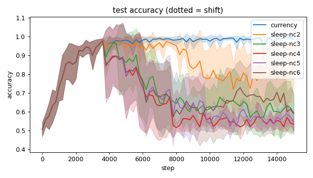
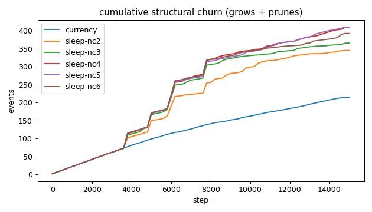
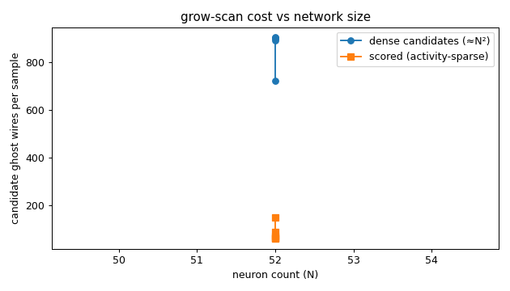
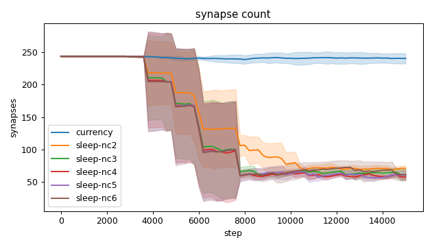
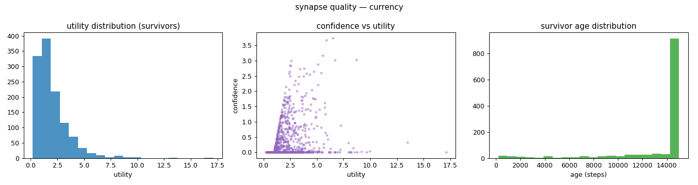
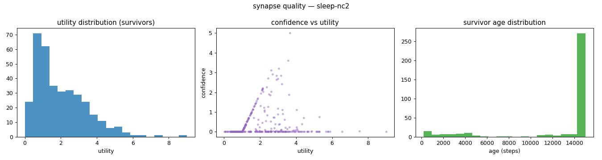
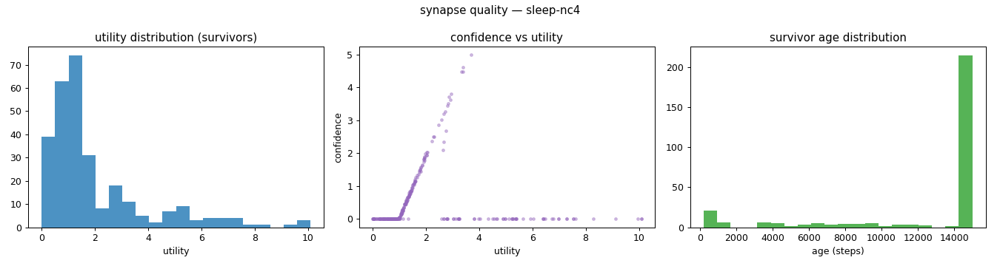
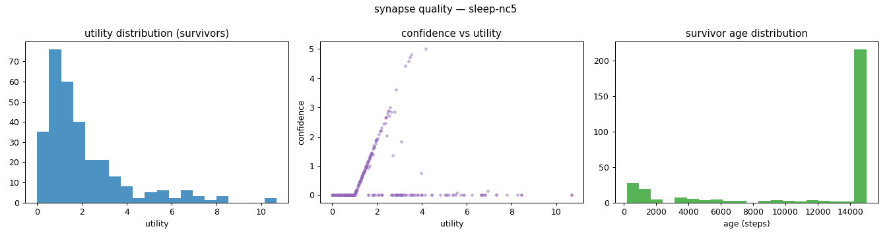
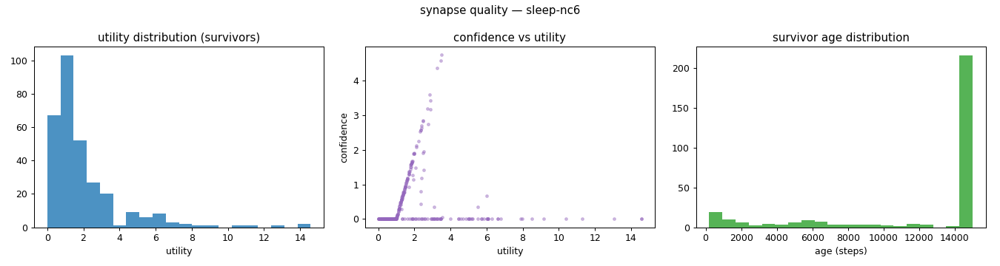
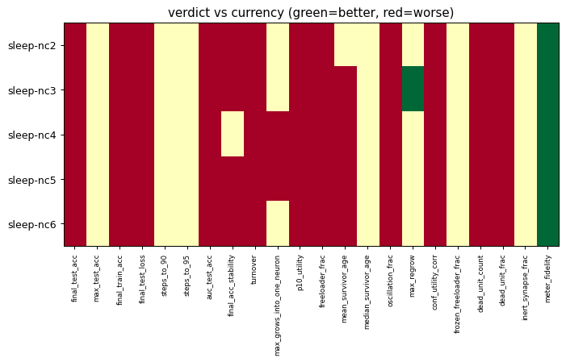

# Evaluation run: sleep-prune-sweep-nocap

- **Date:** 2026-06-03 22:18:21
- **Variants:** currency, sleep-nc2, sleep-nc3, sleep-nc4, sleep-nc5, sleep-nc6  (baseline: currency)
- **Seeds:** 5  |  **Dataset:** spirals  |  **Steps:** 15000 (+0 shift)
- **Commit:** 06b0923
- **Command:** `python evaluate.py --variants currency,sleep-nc2,sleep-nc3,sleep-nc4,sleep-nc5,sleep-nc6 --seeds 5 --dataset spirals --steps 15000 --baseline currency --jobs 6 --no-cache --publish --run-name sleep-prune-sweep-nocap`

## Key metrics

| Metric | What it means | currency (baseline) | sleep-nc2 | sleep-nc3 | sleep-nc4 | sleep-nc5 | sleep-nc6 |
|---|---|---|---|---|---|---|---|
| final_test_acc ↑ | held-out accuracy at the end of the run | 0.989 ± 0.010 | 0.853 ± 0.105 ▼ | 0.595 ± 0.095 ▼ | 0.535 ± 0.035 ▼ | 0.547 ± 0.050 ▼ | 0.590 ± 0.111 ▼ |
| steps_to_90 ↓ | steps to first reach 90% test accuracy | 1801 ± 606.630 | 1801 ± 606.630 ≈ | 1801 ± 606.630 ≈ | 1801 ± 606.630 ≈ | 1801 ± 606.630 ≈ | 1801 ± 606.630 ≈ |
| steps_to_95 ↓ | steps to first reach 95% test accuracy | 2481 ± 785.875 | 2481 ± 785.875 ≈ | 2481 ± 785.875 ≈ | 2481 ± 785.875 ≈ | 2481 ± 785.875 ≈ | 2481 ± 785.875 ≈ |
| auc_test_acc ↑ | area under the test-accuracy curve (speed + level) | 0.943 ± 0.018 | 0.854 ± 0.058 ▼ | 0.724 ± 0.050 ▼ | 0.673 ± 0.037 ▼ | 0.695 ± 0.024 ▼ | 0.725 ± 0.050 ▼ |
| synapse_count_end | live synapses at the end | 240.600 ± 8.015 | 70.800 ± 4.214 ≈ | 60.800 ± 8.109 ≈ | 57.600 ± 4.499 ≈ | 60.800 ± 5.671 ≈ | 61 ± 9.508 ≈ |
| effective_density | live edges as a fraction of fully-connected | 0.418 ± 0.014 | 0.123 ± 0.007 ≈ | 0.106 ± 0.014 ≈ | 0.100 ± 0.008 ≈ | 0.106 ± 0.010 ≈ | 0.106 ± 0.017 ≈ |
| ghost_dense_cost | candidate ghost wires the grow-scan must consider (~N²) | 723.400 ± 8.015 | 893.200 ± 4.214 ≈ | 903.200 ± 8.109 ≈ | 906.400 ± 4.499 ≈ | 903.200 ± 5.671 ≈ | 903 ± 9.508 ≈ |
| ghost_pairs_scored | candidate wires actually scored after activity+demand pruning | 149.784 ± 16.920 | 89.074 ± 14.495 ≈ | 61.863 ± 15.387 ≈ | 65.091 ± 6.785 ≈ | 61.772 ± 21.475 ≈ | 72.709 ± 13.412 ≈ |
| mean_neuron_activation | avg hidden-neuron ReLU output on test data (neuron value) | 0.363 ± 0.020 | 0.237 ± 0.053 ≈ | 0.144 ± 0.036 ≈ | 0.129 ± 0.021 ≈ | 0.119 ± 0.027 ≈ | 0.134 ± 0.021 ≈ |
| dead_unit_frac ↓ | fraction of hidden neurons that never fire (scale-free) | 0.063 ± 0.029 | 0.158 ± 0.047 ▼ | 0.192 ± 0.060 ▼ | 0.188 ± 0.071 ▼ | 0.196 ± 0.054 ▼ | 0.192 ± 0.040 ▼ |
| max_grows_into_one_neuron ↓ | most times one neuron was grown into (churn) | 16.600 ± 5.238 | 15.600 ± 3.007 ≈ | 19.200 ± 4.069 ≈ | 27 ± 7.925 ▼ | 29.800 ± 6.013 ▼ | 25 ± 8.509 ≈ |
| oscillation_frac ↓ | fraction of grown edges grown ≥2× (thrash) | 0.142 ± 0.031 | 0.228 ± 0.048 ▼ | 0.200 ± 0.040 ▼ | 0.261 ± 0.057 ▼ | 0.243 ± 0.046 ▼ | 0.237 ± 0.052 ▼ |
| freeloader_frac ↓ | fraction of synapses below the prune-utility floor | 0.011 ± 0.017 | 0.075 ± 0.031 ▼ | 0.112 ± 0.018 ▼ | 0.129 ± 0.015 ▼ | 0.106 ± 0.027 ▼ | 0.128 ± 0.036 ▼ |
| conf_utility_corr ↑ | corr of confidence with real utility (calibration) | 0.303 ± 0.056 | 0.128 ± 0.100 ▼ | 0.029 ± 0.054 ▼ | 0.042 ± 0.091 ▼ | 0.055 ± 0.073 ▼ | 0.030 ± 0.038 ▼ |
| dead_unit_count ↓ | hidden neurons that never fire on test data | 3 ± 1.414 | 7.600 ± 2.245 ▼ | 9.200 ± 2.857 ▼ | 9 ± 3.406 ▼ | 9.400 ± 2.577 ▼ | 9.200 ± 1.939 ▼ |

## Full scorecard

| Metric | currency (baseline) | sleep-nc2 | sleep-nc3 | sleep-nc4 | sleep-nc5 | sleep-nc6 |
|---|---|---|---|---|---|---|
| **Prediction performance** | | | | | | |
| final_test_acc ↑ | 0.989 ± 0.010 | 0.853 ± 0.105 ▼ | 0.595 ± 0.095 ▼ | 0.535 ± 0.035 ▼ | 0.547 ± 0.050 ▼ | 0.590 ± 0.111 ▼ |
| max_test_acc ↑ | 0.997 ± 0.003 | 0.995 ± 0.004 ≈ | 0.985 ± 0.016 ≈ | 0.985 ± 0.016 ≈ | 0.985 ± 0.016 ≈ | 0.989 ± 0.015 ≈ |
| final_train_acc ↑ | 0.991 ± 0.011 | 0.852 ± 0.108 ▼ | 0.596 ± 0.093 ▼ | 0.535 ± 0.031 ▼ | 0.555 ± 0.061 ▼ | 0.590 ± 0.107 ▼ |
| final_test_loss ↓ | 0.033 ± 0.030 | 0.310 ± 0.190 ▼ | 0.622 ± 0.105 ▼ | 0.659 ± 0.006 ▼ | 0.645 ± 0.056 ▼ | 0.625 ± 0.087 ▼ |
| **Training efficacy** | | | | | | |
| steps_to_90 ↓ | 1801 ± 606.630 | 1801 ± 606.630 ≈ | 1801 ± 606.630 ≈ | 1801 ± 606.630 ≈ | 1801 ± 606.630 ≈ | 1801 ± 606.630 ≈ |
| steps_to_95 ↓ | 2481 ± 785.875 | 2481 ± 785.875 ≈ | 2481 ± 785.875 ≈ | 2481 ± 785.875 ≈ | 2481 ± 785.875 ≈ | 2481 ± 785.875 ≈ |
| auc_test_acc ↑ | 0.943 ± 0.018 | 0.854 ± 0.058 ▼ | 0.724 ± 0.050 ▼ | 0.673 ± 0.037 ▼ | 0.695 ± 0.024 ▼ | 0.725 ± 0.050 ▼ |
| final_acc_stability ↓ | 0.018 ± 0.020 | 0.047 ± 0.010 ▼ | 0.039 ± 0.008 ▼ | 0.036 ± 0.009 ≈ | 0.041 ± 0.009 ▼ | 0.081 ± 0.075 ▼ |
| **Synapse structure** | | | | | | |
| synapse_count_start | 244 ± 0.894 | 244 ± 0.894 ≈ | 244 ± 0.894 ≈ | 244 ± 0.894 ≈ | 244 ± 0.894 ≈ | 244 ± 0.894 ≈ |
| synapse_count_peak | 247.800 ± 4.167 | 244.800 ± 2.227 ≈ | 244.800 ± 2.227 ≈ | 244.800 ± 2.227 ≈ | 244.800 ± 2.227 ≈ | 244.800 ± 2.227 ≈ |
| synapse_count_end | 240.600 ± 8.015 | 70.800 ± 4.214 ≈ | 60.800 ± 8.109 ≈ | 57.600 ± 4.499 ≈ | 60.800 ± 5.671 ≈ | 61 ± 9.508 ≈ |
| n_grow_events | 106.800 ± 9.847 | 87.200 ± 9.928 ≈ | 92.400 ± 14.094 ≈ | 112.600 ± 6.086 ≈ | 114.600 ± 2.939 ≈ | 106 ± 8.786 ≈ |
| n_prune_events | 108.200 ± 7.909 | 258.400 ± 10.557 ≈ | 273.600 ± 18.271 ≈ | 297 ± 6.573 ≈ | 295.800 ± 5.913 ≈ | 287 ± 14.381 ≈ |
| distinct_neurons_grown | 16.600 ± 3.007 | 14.200 ± 1.833 ≈ | 14.200 ± 1.470 ≈ | 14.200 ± 1.470 ≈ | 14.800 ± 1.939 ≈ | 15.200 ± 2.040 ≈ |
| turnover ↓ | 0.889 ± 0.063 | 2.407 ± 0.178 ▼ | 2.798 ± 0.287 ▼ | 3.204 ± 0.369 ▼ | 3.197 ± 0.326 ▼ | 2.998 ± 0.260 ▼ |
| max_grows_into_one_neuron ↓ | 16.600 ± 5.238 | 15.600 ± 3.007 ≈ | 19.200 ± 4.069 ≈ | 27 ± 7.925 ▼ | 29.800 ± 6.013 ▼ | 25 ± 8.509 ≈ |
| mean_fan_in | 4.812 ± 0.160 | 1.416 ± 0.084 ≈ | 1.216 ± 0.162 ≈ | 1.152 ± 0.090 ≈ | 1.216 ± 0.113 ≈ | 1.220 ± 0.190 ≈ |
| mean_fan_out | 4.812 ± 0.160 | 1.416 ± 0.084 ≈ | 1.216 ± 0.162 ≈ | 1.152 ± 0.090 ≈ | 1.216 ± 0.113 ≈ | 1.220 ± 0.190 ≈ |
| effective_density | 0.418 ± 0.014 | 0.123 ± 0.007 ≈ | 0.106 ± 0.014 ≈ | 0.100 ± 0.008 ≈ | 0.106 ± 0.010 ≈ | 0.106 ± 0.017 ≈ |
| **Synapse quality** | | | | | | |
| p10_utility ↑ | 0.711 ± 0.059 | 0.598 ± 0.104 ▼ | 0.504 ± 0.089 ▼ | 0.441 ± 0.040 ▼ | 0.491 ± 0.111 ▼ | 0.473 ± 0.118 ▼ |
| freeloader_frac ↓ | 0.011 ± 0.017 | 0.075 ± 0.031 ▼ | 0.112 ± 0.018 ▼ | 0.129 ± 0.015 ▼ | 0.106 ± 0.027 ▼ | 0.128 ± 0.036 ▼ |
| mean_survivor_age ↑ | 13560 ± 214.305 | 12834 ± 931.444 ≈ | 12828 ± 824.436 ▼ | 12531 ± 760.593 ▼ | 11802 ± 985.885 ▼ | 12144 ± 982.962 ▼ |
| median_survivor_age ↑ | 15000 ± 0 | 15000 ± 0 ≈ | 15000 ± 0 ≈ | 15000 ± 0 ≈ | 15000 ± 0 ≈ | 15000 ± 0 ≈ |
| mean_pruned_lifespan | 3348 ± 358.192 | 4906 ± 674.294 ≈ | 4446 ± 805.635 ≈ | 4162 ± 776.674 ≈ | 4218 ± 758.695 ≈ | 4388 ± 620.475 ≈ |
| oscillation_frac ↓ | 0.142 ± 0.031 | 0.228 ± 0.048 ▼ | 0.200 ± 0.040 ▼ | 0.261 ± 0.057 ▼ | 0.243 ± 0.046 ▼ | 0.237 ± 0.052 ▼ |
| max_regrow ↓ | 3.400 ± 0.490 | 2.600 ± 1.020 ≈ | 2.400 ± 0.490 ▲ | 3.800 ± 0.748 ≈ | 4.200 ± 1.166 ≈ | 2.800 ± 1.166 ≈ |
| conf_utility_corr ↑ | 0.303 ± 0.056 | 0.128 ± 0.100 ▼ | 0.029 ± 0.054 ▼ | 0.042 ± 0.091 ▼ | 0.055 ± 0.073 ▼ | 0.030 ± 0.038 ▼ |
| frozen_freeloader_frac ↓ | 0 ± 0 | 0 ± 0 ≈ | 0 ± 0 ≈ | 0 ± 0 ≈ | 0 ± 0 ≈ | 0 ± 0 ≈ |
| dead_unit_count ↓ | 3 ± 1.414 | 7.600 ± 2.245 ▼ | 9.200 ± 2.857 ▼ | 9 ± 3.406 ▼ | 9.400 ± 2.577 ▼ | 9.200 ± 1.939 ▼ |
| dead_unit_frac ↓ | 0.063 ± 0.029 | 0.158 ± 0.047 ▼ | 0.192 ± 0.060 ▼ | 0.188 ± 0.071 ▼ | 0.196 ± 0.054 ▼ | 0.192 ± 0.040 ▼ |
| mean_neuron_activation | 0.363 ± 0.020 | 0.237 ± 0.053 ≈ | 0.144 ± 0.036 ≈ | 0.129 ± 0.021 ≈ | 0.119 ± 0.027 ≈ | 0.134 ± 0.021 ≈ |
| inert_synapse_frac ↓ | 0 ± 0 | 0 ± 0 ≈ | 0 ± 0 ≈ | 0 ± 0 ≈ | 0 ± 0 ≈ | 0 ± 0 ≈ |
| used_vs_allocated | 0.994 ± 0.031 | 0.293 ± 0.018 ≈ | 0.251 ± 0.033 ≈ | 0.238 ± 0.019 ≈ | 0.251 ± 0.024 ≈ | 0.252 ± 0.040 ≈ |
| **Compute cost** | | | | | | |
| ghost_dense_cost | 723.400 ± 8.015 | 893.200 ± 4.214 ≈ | 903.200 ± 8.109 ≈ | 906.400 ± 4.499 ≈ | 903.200 ± 5.671 ≈ | 903 ± 9.508 ≈ |
| ghost_pairs_scored | 149.784 ± 16.920 | 89.074 ± 14.495 ≈ | 61.863 ± 15.387 ≈ | 65.091 ± 6.785 ≈ | 61.772 ± 21.475 ≈ | 72.709 ± 13.412 ≈ |
| **Signal sanity** | | | | | | |
| meter_fidelity ↑ | 0.648 ± 0.222 | 0.956 ± 0.052 ▲ | 0.994 ± 0.005 ▲ | 0.998 ± 0.002 ▲ | 0.994 ± 0.004 ▲ | 0.995 ± 0.006 ▲ |

Baseline: **currency**. ▲ better / ▼ worse / ≈ no clear difference vs baseline (95% bootstrap CI of the mean difference). Cells show mean ± std across seeds.

## Charts

### acc_curves

### churn_curves

### cost_scaling

### count_curves

### quality_currency

### quality_sleep-nc2

### quality_sleep-nc3

### quality_sleep-nc4

### quality_sleep-nc5

### quality_sleep-nc6

### verdict_heatmap

