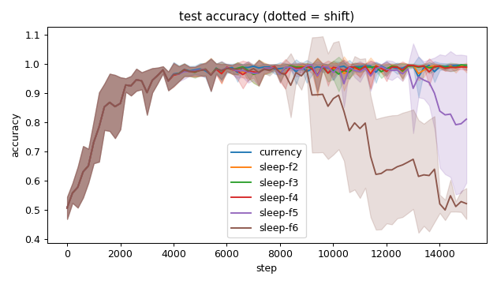
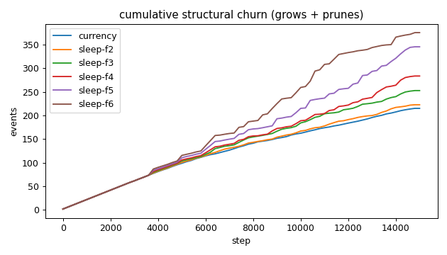
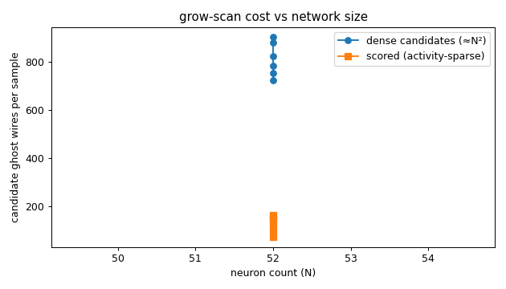
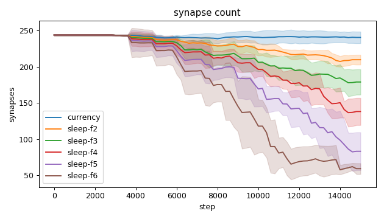
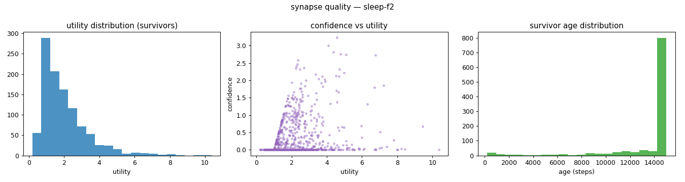
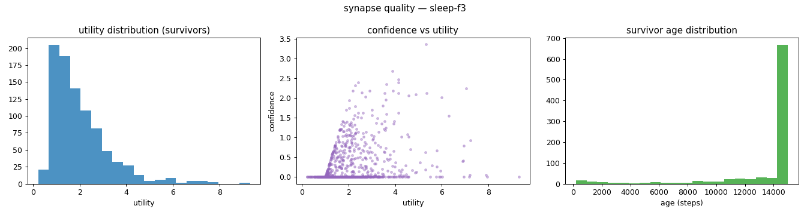
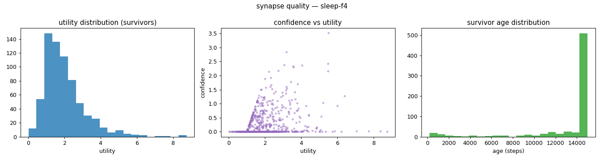
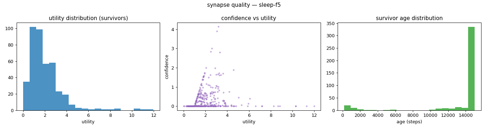
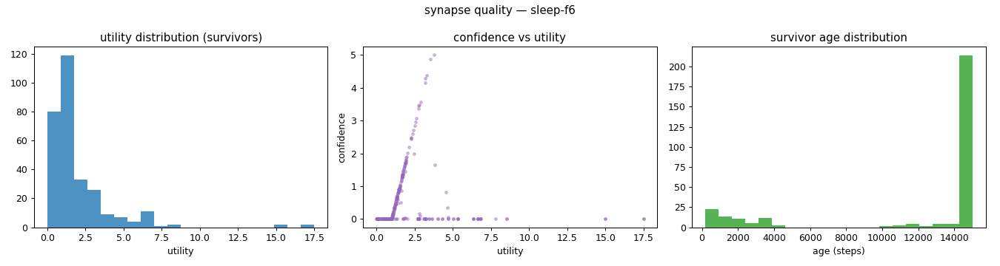
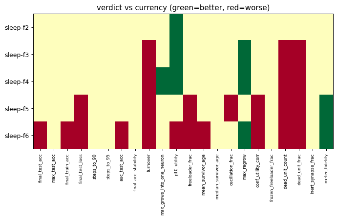

# Evaluation run: sleep-prune-sweep

- **Date:** 2026-06-03 08:39:30
- **Variants:** currency, sleep-f2, sleep-f3, sleep-f4, sleep-f5, sleep-f6  (baseline: currency)
- **Seeds:** 5  |  **Dataset:** spirals  |  **Steps:** 15000 (+0 shift)
- **Commit:** 390fd8b
- **Command:** `python evaluate.py --variants currency,sleep-f2,sleep-f3,sleep-f4,sleep-f5,sleep-f6 --seeds 5 --dataset spirals --steps 15000 --baseline currency --jobs 6 --no-cache --publish --run-name sleep-prune-sweep`

## Key metrics

| Metric | What it means | currency (baseline) | sleep-f2 | sleep-f3 | sleep-f4 | sleep-f5 | sleep-f6 |
|---|---|---|---|---|---|---|---|
| final_test_acc ↑ | held-out accuracy at the end of the run | 0.989 ± 0.010 | 0.987 ± 0.017 ≈ | 0.995 ± 0.005 ≈ | 0.989 ± 0.011 ≈ | 0.811 ± 0.217 ≈ | 0.522 ± 0.053 ▼ |
| steps_to_90 ↓ | steps to first reach 90% test accuracy | 1801 ± 606.630 | 1801 ± 606.630 ≈ | 1801 ± 606.630 ≈ | 1801 ± 606.630 ≈ | 1801 ± 606.630 ≈ | 1801 ± 606.630 ≈ |
| steps_to_95 ↓ | steps to first reach 95% test accuracy | 2481 ± 785.875 | 2481 ± 785.875 ≈ | 2481 ± 785.875 ≈ | 2481 ± 785.875 ≈ | 2481 ± 785.875 ≈ | 2481 ± 785.875 ≈ |
| auc_test_acc ↑ | area under the test-accuracy curve (speed + level) | 0.943 ± 0.018 | 0.941 ± 0.018 ≈ | 0.941 ± 0.019 ≈ | 0.941 ± 0.019 ≈ | 0.923 ± 0.027 ≈ | 0.826 ± 0.043 ▼ |
| synapse_count_end | live synapses at the end | 240.600 ± 8.015 | 209.800 ± 6.794 ≈ | 179 ± 17.504 ≈ | 138.200 ± 18.809 ≈ | 83.200 ± 26.263 ≈ | 59.200 ± 7.440 ≈ |
| effective_density | live edges as a fraction of fully-connected | 0.418 ± 0.014 | 0.364 ± 0.012 ≈ | 0.311 ± 0.030 ≈ | 0.240 ± 0.033 ≈ | 0.144 ± 0.046 ≈ | 0.103 ± 0.013 ≈ |
| ghost_dense_cost | candidate ghost wires the grow-scan must consider (~N²) | 723.400 ± 8.015 | 754.200 ± 6.794 ≈ | 785 ± 17.504 ≈ | 825.800 ± 18.809 ≈ | 880.800 ± 26.263 ≈ | 904.800 ± 7.440 ≈ |
| ghost_pairs_scored | candidate wires actually scored after activity+demand pruning | 149.784 ± 16.920 | 161.339 ± 19.092 ≈ | 150.197 ± 11.066 ≈ | 130.068 ± 16.343 ≈ | 104.115 ± 34.383 ≈ | 72.083 ± 8.760 ≈ |
| mean_neuron_activation | avg hidden-neuron ReLU output on test data (neuron value) | 0.363 ± 0.020 | 0.365 ± 0.035 ≈ | 0.363 ± 0.027 ≈ | 0.360 ± 0.034 ≈ | 0.287 ± 0.080 ≈ | 0.149 ± 0.043 ≈ |
| dead_unit_frac ↓ | fraction of hidden neurons that never fire (scale-free) | 0.063 ± 0.029 | 0.071 ± 0.028 ≈ | 0.113 ± 0.021 ▼ | 0.158 ± 0.028 ▼ | 0.175 ± 0.060 ▼ | 0.212 ± 0.064 ▼ |
| max_grows_into_one_neuron ↓ | most times one neuron was grown into (churn) | 16.600 ± 5.238 | 13.400 ± 1.497 ≈ | 13.600 ± 1.855 ≈ | 12.600 ± 1.356 ▲ | 14.800 ± 2.400 ≈ | 20 ± 2.280 ≈ |
| oscillation_frac ↓ | fraction of grown edges grown ≥2× (thrash) | 0.142 ± 0.031 | 0.148 ± 0.032 ≈ | 0.170 ± 0.025 ≈ | 0.180 ± 0.041 ≈ | 0.202 ± 0.020 ▼ | 0.179 ± 0.060 ≈ |
| freeloader_frac ↓ | fraction of synapses below the prune-utility floor | 0.011 ± 0.017 | 0.012 ± 0.004 ≈ | 0.012 ± 0.008 ≈ | 0.020 ± 0.011 ≈ | 0.054 ± 0.036 ▼ | 0.094 ± 0.044 ▼ |
| conf_utility_corr ↑ | corr of confidence with real utility (calibration) | 0.303 ± 0.056 | 0.286 ± 0.085 ≈ | 0.325 ± 0.059 ≈ | 0.283 ± 0.117 ≈ | 0.161 ± 0.125 ▼ | 0.048 ± 0.064 ▼ |
| dead_unit_count ↓ | hidden neurons that never fire on test data | 3 ± 1.414 | 3.400 ± 1.356 ≈ | 5.400 ± 1.020 ▼ | 7.600 ± 1.356 ▼ | 8.400 ± 2.871 ▼ | 10.200 ± 3.059 ▼ |

## Full scorecard

| Metric | currency (baseline) | sleep-f2 | sleep-f3 | sleep-f4 | sleep-f5 | sleep-f6 |
|---|---|---|---|---|---|---|
| **Prediction performance** | | | | | | |
| final_test_acc ↑ | 0.989 ± 0.010 | 0.987 ± 0.017 ≈ | 0.995 ± 0.005 ≈ | 0.989 ± 0.011 ≈ | 0.811 ± 0.217 ≈ | 0.522 ± 0.053 ▼ |
| max_test_acc ↑ | 0.997 ± 0.003 | 0.997 ± 0.004 ≈ | 0.999 ± 0.001 ≈ | 0.997 ± 0.003 ≈ | 0.997 ± 0.003 ≈ | 0.997 ± 0.006 ≈ |
| final_train_acc ↑ | 0.991 ± 0.011 | 0.992 ± 0.011 ≈ | 0.996 ± 0.005 ≈ | 0.990 ± 0.010 ≈ | 0.813 ± 0.220 ≈ | 0.522 ± 0.050 ▼ |
| final_test_loss ↓ | 0.033 ± 0.030 | 0.040 ± 0.045 ≈ | 0.015 ± 0.009 ≈ | 0.035 ± 0.025 ≈ | 0.301 ± 0.311 ▼ | 0.662 ± 0.039 ▼ |
| **Training efficacy** | | | | | | |
| steps_to_90 ↓ | 1801 ± 606.630 | 1801 ± 606.630 ≈ | 1801 ± 606.630 ≈ | 1801 ± 606.630 ≈ | 1801 ± 606.630 ≈ | 1801 ± 606.630 ≈ |
| steps_to_95 ↓ | 2481 ± 785.875 | 2481 ± 785.875 ≈ | 2481 ± 785.875 ≈ | 2481 ± 785.875 ≈ | 2481 ± 785.875 ≈ | 2481 ± 785.875 ≈ |
| auc_test_acc ↑ | 0.943 ± 0.018 | 0.941 ± 0.018 ≈ | 0.941 ± 0.019 ≈ | 0.941 ± 0.019 ≈ | 0.923 ± 0.027 ≈ | 0.826 ± 0.043 ▼ |
| final_acc_stability ↓ | 0.018 ± 0.020 | 0.014 ± 0.006 ≈ | 0.006 ± 0.004 ≈ | 0.010 ± 0.011 ≈ | 0.082 ± 0.081 ≈ | 0.069 ± 0.086 ≈ |
| **Synapse structure** | | | | | | |
| synapse_count_start | 244 ± 0.894 | 244 ± 0.894 ≈ | 244 ± 0.894 ≈ | 244 ± 0.894 ≈ | 244 ± 0.894 ≈ | 244 ± 0.894 ≈ |
| synapse_count_peak | 247.800 ± 4.167 | 244.800 ± 2.227 ≈ | 244.800 ± 2.227 ≈ | 244.800 ± 2.227 ≈ | 244.800 ± 2.227 ≈ | 244.800 ± 2.227 ≈ |
| synapse_count_end | 240.600 ± 8.015 | 209.800 ± 6.794 ≈ | 179 ± 17.504 ≈ | 138.200 ± 18.809 ≈ | 83.200 ± 26.263 ≈ | 59.200 ± 7.440 ≈ |
| n_grow_events | 106.800 ± 9.847 | 95.200 ± 7.111 ≈ | 94.800 ± 6.306 ≈ | 89.800 ± 5.600 ≈ | 93.200 ± 3.919 ≈ | 96.200 ± 7.277 ≈ |
| n_prune_events | 108.200 ± 7.909 | 127.400 ± 7.283 ≈ | 157.800 ± 13.467 ≈ | 193.600 ± 17.962 ≈ | 252 ± 29.886 ≈ | 279 ± 10.431 ≈ |
| distinct_neurons_grown | 16.600 ± 3.007 | 15.200 ± 2.135 ≈ | 15.400 ± 1.744 ≈ | 15.800 ± 1.470 ≈ | 15.200 ± 0.748 ≈ | 14.400 ± 2.728 ≈ |
| turnover ↓ | 0.889 ± 0.063 | 0.967 ± 0.059 ≈ | 1.159 ± 0.092 ▼ | 1.360 ± 0.105 ▼ | 1.820 ± 0.219 ▼ | 2.289 ± 0.223 ▼ |
| max_grows_into_one_neuron ↓ | 16.600 ± 5.238 | 13.400 ± 1.497 ≈ | 13.600 ± 1.855 ≈ | 12.600 ± 1.356 ▲ | 14.800 ± 2.400 ≈ | 20 ± 2.280 ≈ |
| mean_fan_in | 4.812 ± 0.160 | 4.196 ± 0.136 ≈ | 3.580 ± 0.350 ≈ | 2.764 ± 0.376 ≈ | 1.664 ± 0.525 ≈ | 1.184 ± 0.149 ≈ |
| mean_fan_out | 4.812 ± 0.160 | 4.196 ± 0.136 ≈ | 3.580 ± 0.350 ≈ | 2.764 ± 0.376 ≈ | 1.664 ± 0.525 ≈ | 1.184 ± 0.149 ≈ |
| effective_density | 0.418 ± 0.014 | 0.364 ± 0.012 ≈ | 0.311 ± 0.030 ≈ | 0.240 ± 0.033 ≈ | 0.144 ± 0.046 ≈ | 0.103 ± 0.013 ≈ |
| **Synapse quality** | | | | | | |
| p10_utility ↑ | 0.711 ± 0.059 | 0.798 ± 0.039 ▲ | 0.911 ± 0.050 ▲ | 0.901 ± 0.132 ▲ | 0.657 ± 0.116 ≈ | 0.543 ± 0.109 ▼ |
| freeloader_frac ↓ | 0.011 ± 0.017 | 0.012 ± 0.004 ≈ | 0.012 ± 0.008 ≈ | 0.020 ± 0.011 ≈ | 0.054 ± 0.036 ▼ | 0.094 ± 0.044 ▼ |
| mean_survivor_age ↑ | 13560 ± 214.305 | 13662 ± 138.772 ≈ | 13556 ± 159.931 ≈ | 13391 ± 208.512 ≈ | 13421 ± 620.917 ≈ | 12048 ± 1166 ▼ |
| median_survivor_age ↑ | 15000 ± 0 | 15000 ± 0 ≈ | 15000 ± 0 ≈ | 15000 ± 0 ≈ | 15000 ± 0 ≈ | 15000 ± 0 ≈ |
| mean_pruned_lifespan | 3348 ± 358.192 | 4670 ± 444.401 ≈ | 5435 ± 445.357 ≈ | 6650 ± 408.215 ≈ | 6909 ± 633.012 ≈ | 6430 ± 815.671 ≈ |
| oscillation_frac ↓ | 0.142 ± 0.031 | 0.148 ± 0.032 ≈ | 0.170 ± 0.025 ≈ | 0.180 ± 0.041 ≈ | 0.202 ± 0.020 ▼ | 0.179 ± 0.060 ≈ |
| max_regrow ↓ | 3.400 ± 0.490 | 2.600 ± 0.800 ≈ | 2.600 ± 0.490 ▲ | 2.400 ± 0.490 ▲ | 3 ± 0.894 ≈ | 2.200 ± 0.748 ▲ |
| conf_utility_corr ↑ | 0.303 ± 0.056 | 0.286 ± 0.085 ≈ | 0.325 ± 0.059 ≈ | 0.283 ± 0.117 ≈ | 0.161 ± 0.125 ▼ | 0.048 ± 0.064 ▼ |
| frozen_freeloader_frac ↓ | 0 ± 0 | 0 ± 0 ≈ | 0 ± 0 ≈ | 0 ± 0 ≈ | 0 ± 0 ≈ | 0 ± 0 ≈ |
| dead_unit_count ↓ | 3 ± 1.414 | 3.400 ± 1.356 ≈ | 5.400 ± 1.020 ▼ | 7.600 ± 1.356 ▼ | 8.400 ± 2.871 ▼ | 10.200 ± 3.059 ▼ |
| dead_unit_frac ↓ | 0.063 ± 0.029 | 0.071 ± 0.028 ≈ | 0.113 ± 0.021 ▼ | 0.158 ± 0.028 ▼ | 0.175 ± 0.060 ▼ | 0.212 ± 0.064 ▼ |
| mean_neuron_activation | 0.363 ± 0.020 | 0.365 ± 0.035 ≈ | 0.363 ± 0.027 ≈ | 0.360 ± 0.034 ≈ | 0.287 ± 0.080 ≈ | 0.149 ± 0.043 ≈ |
| inert_synapse_frac ↓ | 0 ± 0 | 0 ± 0 ≈ | 0 ± 0 ≈ | 0 ± 0 ≈ | 0 ± 0 ≈ | 0 ± 0 ≈ |
| used_vs_allocated | 0.994 ± 0.031 | 0.867 ± 0.027 ≈ | 0.740 ± 0.071 ≈ | 0.571 ± 0.078 ≈ | 0.344 ± 0.109 ≈ | 0.245 ± 0.031 ≈ |
| **Compute cost** | | | | | | |
| ghost_dense_cost | 723.400 ± 8.015 | 754.200 ± 6.794 ≈ | 785 ± 17.504 ≈ | 825.800 ± 18.809 ≈ | 880.800 ± 26.263 ≈ | 904.800 ± 7.440 ≈ |
| ghost_pairs_scored | 149.784 ± 16.920 | 161.339 ± 19.092 ≈ | 150.197 ± 11.066 ≈ | 130.068 ± 16.343 ≈ | 104.115 ± 34.383 ≈ | 72.083 ± 8.760 ≈ |
| **Signal sanity** | | | | | | |
| meter_fidelity ↑ | 0.648 ± 0.222 | 0.790 ± 0.080 ≈ | 0.741 ± 0.083 ≈ | 0.782 ± 0.056 ≈ | 0.950 ± 0.044 ▲ | 0.998 ± 0.001 ▲ |

Baseline: **currency**. ▲ better / ▼ worse / ≈ no clear difference vs baseline (95% bootstrap CI of the mean difference). Cells show mean ± std across seeds.

## Charts

### acc_curves

### churn_curves

### cost_scaling

### count_curves

### quality_currency

### quality_sleep-f2

### quality_sleep-f3

### quality_sleep-f4

### quality_sleep-f5

### quality_sleep-f6

### verdict_heatmap

