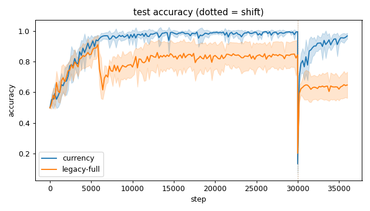
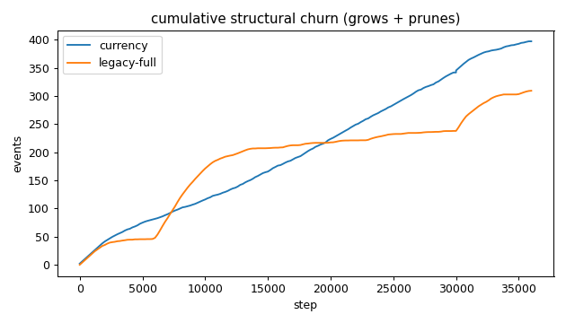
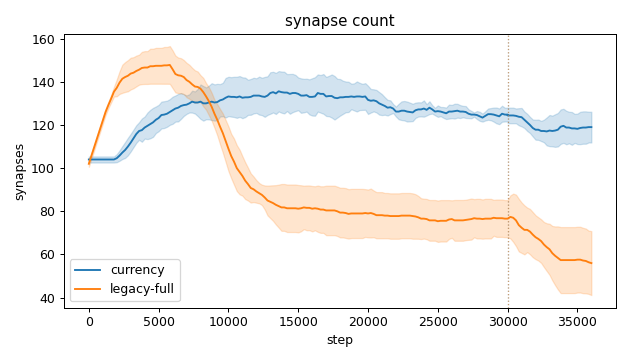
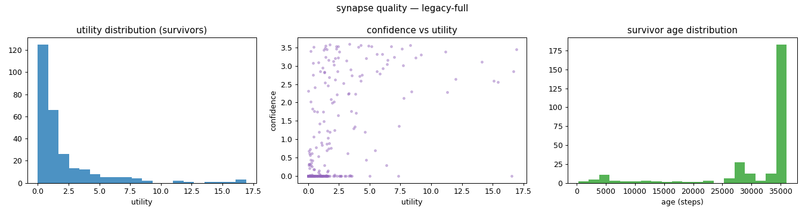
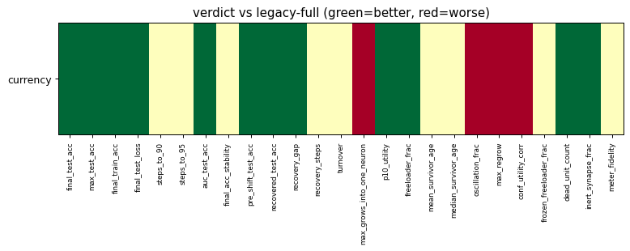

# Evaluation run: spirals-currency-vs-legacy

- **Date:** 2026-05-30 18:05:11
- **Variants:** currency, legacy-full  (baseline: legacy-full)
- **Seeds:** 5  |  **Dataset:** spirals  |  **Steps:** 30000 (+6000 shift)
- **Commit:** 7910612
- **Command:** `python evaluate.py --variants currency,legacy-full --seeds 5 --dataset spirals --steps 30000 --shift 6000 --baseline legacy-full --jobs 6 --no-cache --publish --run-name spirals-currency-vs-legacy --out output/eval/spirals-currency-vs-legacy`

## Key metrics

| Metric | currency | legacy-full (baseline) |
|---|---|---|
| final_test_acc ↑ | 0.967 ± 0.019 ▲ | 0.647 ± 0.086 |
| pre_shift_test_acc ↑ | 0.993 ± 0.004 ▲ | 0.843 ± 0.089 |
| recovered_test_acc ↑ | 0.967 ± 0.019 ▲ | 0.647 ± 0.086 |
| auc_test_acc ↑ | 0.926 ± 0.013 ▲ | 0.773 ± 0.054 |
| max_grows_into_one_neuron ↓ | 29.800 ± 3.970 ▼ | 6 ± 0 |
| oscillation_frac ↓ | 0.333 ± 0.052 ▼ | 0.196 ± 0.032 |
| freeloader_frac ↓ | 0.023 ± 0.016 ▲ | 0.411 ± 0.160 |
| conf_utility_corr ↑ | -0.172 ± 0.054 ▼ | 0.685 ± 0.135 |
| dead_unit_count ↓ | 4.400 ± 1.020 ▲ | 15.200 ± 4.308 |

## Full scorecard

| Metric | currency | legacy-full (baseline) |
|---|---|---|
| **Prediction performance** | | |
| final_test_acc ↑ | 0.967 ± 0.019 ▲ | 0.647 ± 0.086 |
| max_test_acc ↑ | 0.996 ± 0.004 ▲ | 0.938 ± 0.051 |
| final_train_acc ↑ | 0.971 ± 0.021 ▲ | 0.646 ± 0.085 |
| final_test_loss ↓ | 0.111 ± 0.047 ▲ | 0.580 ± 0.068 |
| **Training efficacy** | | |
| steps_to_90 ↓ | 4121 ± 765.245 ? | ∞ ± — |
| steps_to_95 ↓ | 5521 ± 968.297 ? | ∞ ± — |
| auc_test_acc ↑ | 0.926 ± 0.013 ▲ | 0.773 ± 0.054 |
| final_acc_stability ↓ | 0.022 ± 0.015 ≈ | 0.016 ± 0.011 |
| pre_shift_test_acc ↑ | 0.993 ± 0.004 ▲ | 0.843 ± 0.089 |
| recovered_test_acc ↑ | 0.967 ± 0.019 ▲ | 0.647 ± 0.086 |
| recovery_gap ↓ | 0.027 ± 0.015 ▲ | 0.196 ± 0.125 |
| recovery_steps ↓ | ∞ ± — ? | ∞ ± — |
| **Synapse structure** | | |
| synapse_count_start | 104 ± 1.414 ≈ | 102 ± 1.414 |
| synapse_count_peak | 138.600 ± 6.280 ≈ | 147.800 ± 8.750 |
| synapse_count_end | 119 ± 7.127 ≈ | 56 ± 14.819 |
| n_grow_events | 207 ± 27.619 ≈ | 131.600 ± 12.371 |
| n_prune_events | 190 ± 27.907 ≈ | 177.600 ± 26.658 |
| distinct_neurons_grown | 15.800 ± 0.980 ≈ | 22.200 ± 1.939 |
| turnover ↓ | 3.160 ± 0.397 ≈ | 3.364 ± 0.618 |
| max_grows_into_one_neuron ↓ | 29.800 ± 3.970 ▼ | 6 ± 0 |
| mean_fan_in | 3.967 ± 0.238 ≈ | 1.867 ± 0.494 |
| mean_fan_out | 3.967 ± 0.238 ≈ | 1.867 ± 0.494 |
| effective_density | 0.551 ± 0.033 ≈ | 0.259 ± 0.069 |
| **Synapse quality** | | |
| p10_utility ↑ | 0.628 ± 0.025 ▲ | 0.004 ± 0.006 |
| freeloader_frac ↓ | 0.023 ± 0.016 ▲ | 0.411 ± 0.160 |
| mean_survivor_age ↑ | 30145 ± 1091 ≈ | 30698 ± 1587 |
| median_survivor_age ↑ | 36000 ± 0 ≈ | 35500 ± 1000 |
| mean_pruned_lifespan | 4905 ± 644.839 ≈ | 9025 ± 1431 |
| oscillation_frac ↓ | 0.333 ± 0.052 ▼ | 0.196 ± 0.032 |
| max_regrow ↓ | 10 ± 2 ▼ | 3.600 ± 0.490 |
| conf_utility_corr ↑ | -0.172 ± 0.054 ▼ | 0.685 ± 0.135 |
| frozen_freeloader_frac ↓ | 0.009 ± 0.008 ≈ | 0.028 ± 0.022 |
| dead_unit_count ↓ | 4.400 ± 1.020 ▲ | 15.200 ± 4.308 |
| inert_synapse_frac ↓ | 0 ± 0 ▲ | 0.139 ± 0.045 |
| used_vs_allocated | 1.167 ± 0.079 ≈ | 0.548 ± 0.143 |
| **Signal sanity** | | |
| meter_fidelity ↑ | 0.880 ± 0.129 ? | — ± — |

Baseline: **legacy-full**. ▲ better / ▼ worse / ≈ no clear difference vs baseline (95% bootstrap CI of the mean difference). Cells show mean ± std across seeds.

## Charts

### acc_curves

### churn_curves

### count_curves

### quality_currency

### quality_legacy-full

### verdict_heatmap

