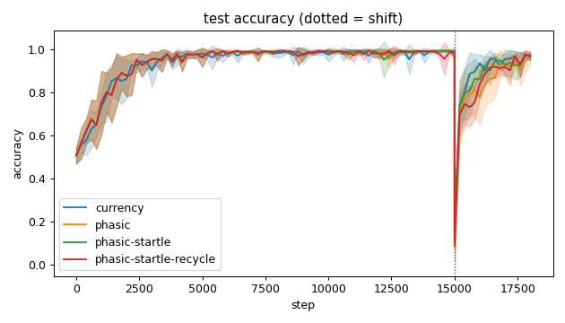
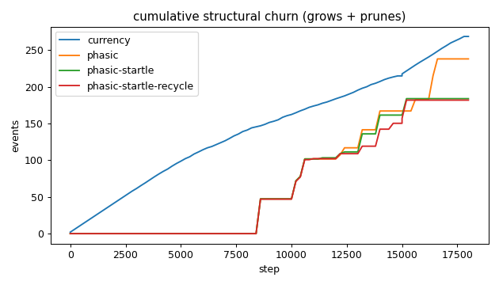
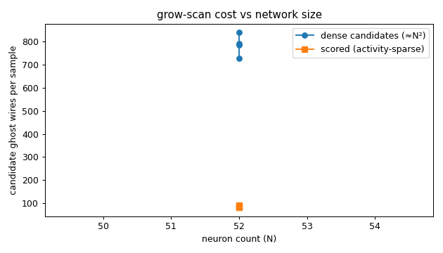
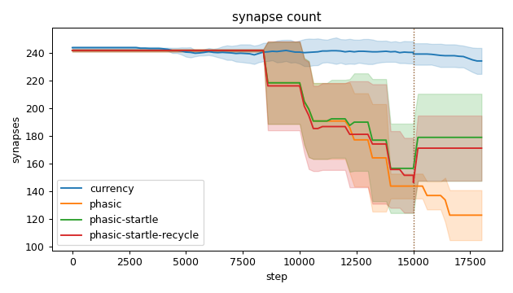
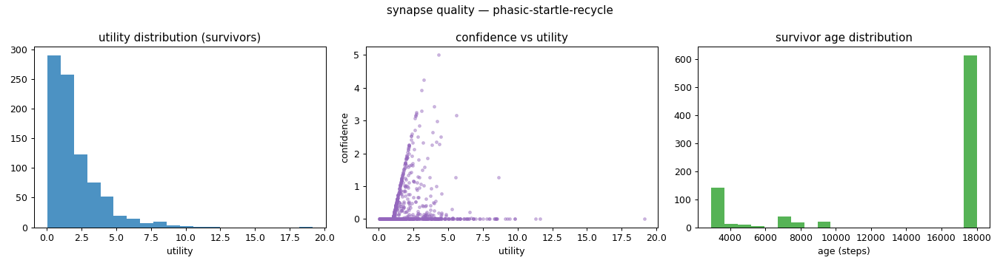
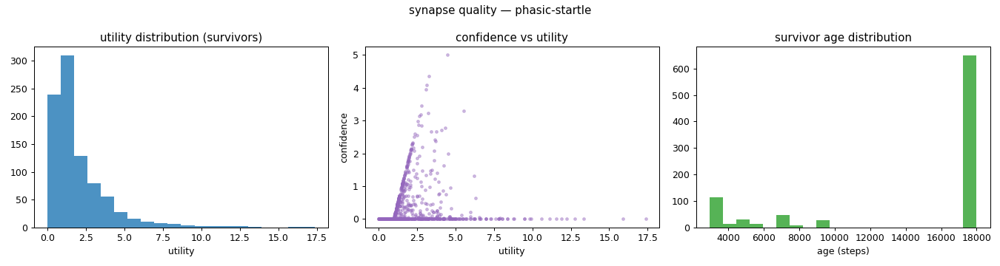
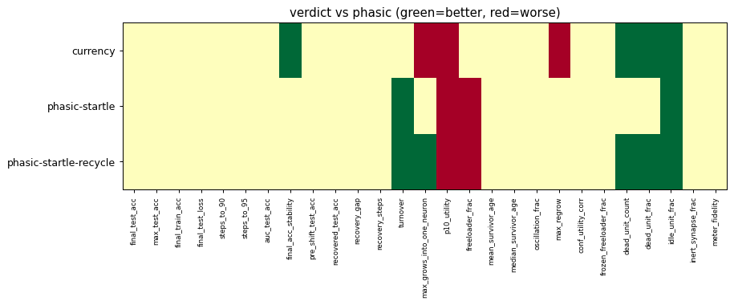

# Evaluation run: startle-vs-phasic

- **Date:** 2026-06-11 23:34:22
- **Variants:** currency, phasic, phasic-startle, phasic-startle-recycle  (baseline: phasic)
- **Seeds:** 5  |  **Dataset:** spirals  |  **Steps:** 15000 (+3000 shift)
- **Commit:** 9ad9af3
- **Command:** `python evaluate.py --variants currency,phasic,phasic-startle,phasic-startle-recycle --seeds 5 --dataset spirals --steps 15000 --shift 3000 --baseline phasic --jobs 6 --no-cache --publish --run-name startle-vs-phasic`

## Key metrics

| Metric | What it means | currency | phasic (baseline) | phasic-startle | phasic-startle-recycle |
|---|---|---|---|---|---|
| final_test_acc ↑ | held-out accuracy at the end of the run | 0.973 ± 0.014 ≈ | 0.963 ± 0.031 | 0.967 ± 0.018 ≈ | 0.969 ± 0.021 ≈ |
| steps_to_90 ↓ | steps to first reach 90% test accuracy | 1801 ± 606.630 ≈ | 1721 ± 587.878 | 1721 ± 587.878 ≈ | 1721 ± 587.878 ≈ |
| steps_to_95 ↓ | steps to first reach 95% test accuracy | 2481 ± 785.875 ≈ | 2681 ± 881.816 | 2681 ± 881.816 ≈ | 2681 ± 881.816 ≈ |
| auc_test_acc ↑ | area under the test-accuracy curve (speed + level) | 0.934 ± 0.021 ≈ | 0.928 ± 0.026 | 0.933 ± 0.023 ≈ | 0.928 ± 0.021 ≈ |
| pre_shift_test_acc ↑ | test accuracy just before the concept shift | 0.989 ± 0.010 ≈ | 0.981 ± 0.027 | 0.981 ± 0.027 ≈ | 0.986 ± 0.012 ≈ |
| recovered_test_acc ↑ | test accuracy at the end, after the label swap | 0.973 ± 0.014 ≈ | 0.963 ± 0.031 | 0.967 ± 0.018 ≈ | 0.969 ± 0.021 ≈ |
| synapse_count_end | live synapses at the end | 234.400 ± 9.394 ≈ | 123 ± 18.078 | 179.200 ± 31.486 ≈ | 171.400 ± 23.525 ≈ |
| effective_density | live edges as a fraction of fully-connected | 0.407 ± 0.016 ≈ | 0.214 ± 0.031 | 0.311 ± 0.055 ≈ | 0.298 ± 0.041 ≈ |
| ghost_dense_cost | candidate ghost wires the grow-scan must consider (~N²) | 729.600 ± 9.394 ≈ | 841 ± 18.078 | 784.800 ± 31.486 ≈ | 792.600 ± 23.525 ≈ |
| ghost_pairs_scored | candidate wires actually scored after activity+demand pruning | 85.379 ± 14.711 ≈ | 81.664 ± 15.473 | 80.972 ± 19.655 ≈ | 91.560 ± 16.670 ≈ |
| mean_neuron_activation | avg hidden-neuron ReLU output on test data (neuron value) | 0.221 ± 0.031 ≈ | 0.254 ± 0.046 | 0.276 ± 0.087 ≈ | 0.293 ± 0.054 ≈ |
| dead_unit_frac ↓ | fraction of hidden neurons that never fire (scale-free) | 0.092 ± 0.028 ▲ | 0.179 ± 0.049 | 0.138 ± 0.028 ≈ | 0.067 ± 0.042 ▲ |
| idle_unit_frac ↓ | fraction of hidden neurons dead OR outputless (not in service) | 0.125 ± 0.013 ▲ | 0.300 ± 0.043 | 0.221 ± 0.050 ▲ | 0.233 ± 0.036 ▲ |
| n_recycle_events | dead-unit recycles fired over the run (sleep recycling) | 0 ± 0 ≈ | 0 ± 0 | 0 ± 0 ≈ | 4.600 ± 2.417 ≈ |
| recycled_rehired_frac | of recycled units, fraction back in service at the end | — ± — ? | — ± — | — ± — ? | 0 ± 0 ? |
| n_startle_events | demand-spike hiring alarms fired (startle growth) | 0 ± 0 ≈ | 0 ± 0 | 2 ± 0.632 ≈ | 1.600 ± 0.490 ≈ |
| max_grows_into_one_neuron ↓ | most times one neuron was grown into (churn) | 17.800 ± 4.956 ▼ | 13.200 ± 2.786 | 10.600 ± 3.007 ≈ | 10 ± 1.095 ▲ |
| oscillation_frac ↓ | fraction of grown edges grown ≥2× (thrash) | 0.139 ± 0.020 ≈ | 0.063 ± 0.126 | 0.058 ± 0.117 ≈ | 0.023 ± 0.036 ≈ |
| freeloader_frac ↓ | fraction of synapses below the prune-utility floor | 0.052 ± 0.035 ≈ | 0.024 ± 0.012 | 0.124 ± 0.027 ▼ | 0.129 ± 0.015 ▼ |
| conf_utility_corr ↑ | corr of confidence with real utility (calibration) | 0.064 ± 0.034 ≈ | 0.099 ± 0.113 | 0.085 ± 0.052 ≈ | 0.104 ± 0.042 ≈ |
| dead_unit_count ↓ | hidden neurons that never fire on test data | 4.400 ± 1.356 ▲ | 8.600 ± 2.332 | 6.600 ± 1.356 ≈ | 3.200 ± 2.040 ▲ |

## Full scorecard

| Metric | currency | phasic (baseline) | phasic-startle | phasic-startle-recycle |
|---|---|---|---|---|
| **Prediction performance** | | | | |
| final_test_acc ↑ | 0.973 ± 0.014 ≈ | 0.963 ± 0.031 | 0.967 ± 0.018 ≈ | 0.969 ± 0.021 ≈ |
| max_test_acc ↑ | 0.997 ± 0.003 ≈ | 0.998 ± 0.002 | 0.997 ± 0.002 ≈ | 0.998 ± 0.003 ≈ |
| final_train_acc ↑ | 0.976 ± 0.018 ≈ | 0.966 ± 0.033 | 0.971 ± 0.019 ≈ | 0.969 ± 0.022 ≈ |
| final_test_loss ↓ | 0.069 ± 0.041 ≈ | 0.117 ± 0.062 | 0.103 ± 0.032 ≈ | 0.098 ± 0.038 ≈ |
| **Training efficacy** | | | | |
| steps_to_90 ↓ | 1801 ± 606.630 ≈ | 1721 ± 587.878 | 1721 ± 587.878 ≈ | 1721 ± 587.878 ≈ |
| steps_to_95 ↓ | 2481 ± 785.875 ≈ | 2681 ± 881.816 | 2681 ± 881.816 ≈ | 2681 ± 881.816 ≈ |
| auc_test_acc ↑ | 0.934 ± 0.021 ≈ | 0.928 ± 0.026 | 0.933 ± 0.023 ≈ | 0.928 ± 0.021 ≈ |
| final_acc_stability ↓ | 0.035 ± 0.017 ▲ | 0.062 ± 0.022 | 0.045 ± 0.019 ≈ | 0.046 ± 0.010 ≈ |
| pre_shift_test_acc ↑ | 0.989 ± 0.010 ≈ | 0.981 ± 0.027 | 0.981 ± 0.027 ≈ | 0.986 ± 0.012 ≈ |
| recovered_test_acc ↑ | 0.973 ± 0.014 ≈ | 0.963 ± 0.031 | 0.967 ± 0.018 ≈ | 0.969 ± 0.021 ≈ |
| recovery_gap ↓ | 0.016 ± 0.014 ≈ | 0.018 ± 0.049 | 0.014 ± 0.021 ≈ | 0.017 ± 0.030 ≈ |
| recovery_steps ↓ | ∞ ± — ? | ∞ ± — | ∞ ± — ? | ∞ ± — ? |
| **Synapse structure** | | | | |
| synapse_count_start | 244 ± 0.894 ≈ | 242 ± 0.894 | 242 ± 0.894 ≈ | 242 ± 0.894 ≈ |
| synapse_count_peak | 247.800 ± 4.167 ≈ | 242 ± 0.894 | 242 ± 0.894 ≈ | 242 ± 0.894 ≈ |
| synapse_count_end | 234.400 ± 9.394 ≈ | 123 ± 18.078 | 179.200 ± 31.486 ≈ | 171.400 ± 23.525 ≈ |
| n_grow_events | 130.600 ± 10.911 ≈ | 59.600 ± 9.091 | 60.600 ± 8.040 ≈ | 59.600 ± 12.241 ≈ |
| n_prune_events | 138.200 ± 7.909 ≈ | 178.600 ± 10.012 | 123.400 ± 27.104 ≈ | 122.400 ± 14.800 ≈ |
| n_startle_events | 0 ± 0 ≈ | 0 ± 0 | 2 ± 0.632 ≈ | 1.600 ± 0.490 ≈ |
| distinct_neurons_grown | 19.200 ± 2.786 ≈ | 13.600 ± 1.744 | 16.800 ± 1.600 ≈ | 16.200 ± 1.939 ≈ |
| turnover ↓ | 1.115 ± 0.065 ≈ | 1.180 ± 0.053 | 0.878 ± 0.168 ▲ | 0.876 ± 0.126 ▲ |
| max_grows_into_one_neuron ↓ | 17.800 ± 4.956 ▼ | 13.200 ± 2.786 | 10.600 ± 3.007 ≈ | 10 ± 1.095 ▲ |
| mean_fan_in | 4.688 ± 0.188 ≈ | 2.460 ± 0.362 | 3.584 ± 0.630 ≈ | 3.428 ± 0.471 ≈ |
| mean_fan_out | 4.688 ± 0.188 ≈ | 2.460 ± 0.362 | 3.584 ± 0.630 ≈ | 3.428 ± 0.471 ≈ |
| effective_density | 0.407 ± 0.016 ≈ | 0.214 ± 0.031 | 0.311 ± 0.055 ≈ | 0.298 ± 0.041 ≈ |
| **Synapse quality** | | | | |
| p10_utility ↑ | 0.580 ± 0.050 ▼ | 0.767 ± 0.068 | 0.394 ± 0.119 ▼ | 0.423 ± 0.052 ▼ |
| freeloader_frac ↓ | 0.052 ± 0.035 ≈ | 0.024 ± 0.012 | 0.124 ± 0.027 ▼ | 0.129 ± 0.015 ▼ |
| mean_survivor_age ↑ | 15590 ± 226.611 ≈ | 14259 ± 1902 | 14490 ± 702.392 ≈ | 14320 ± 771.949 ≈ |
| median_survivor_age ↑ | 18000 ± 0 ≈ | 18000 ± 0 | 18000 ± 0 ≈ | 18000 ± 0 ≈ |
| mean_pruned_lifespan | 4976 ± 147.466 ≈ | 10985 ± 1654 | 10452 ± 1864 ≈ | 10573 ± 1984 ≈ |
| oscillation_frac ↓ | 0.139 ± 0.020 ≈ | 0.063 ± 0.126 | 0.058 ± 0.117 ≈ | 0.023 ± 0.036 ≈ |
| max_regrow ↓ | 3.400 ± 0.490 ▼ | 0.400 ± 0.800 | 0.200 ± 0.400 ≈ | 0.400 ± 0.490 ≈ |
| conf_utility_corr ↑ | 0.064 ± 0.034 ≈ | 0.099 ± 0.113 | 0.085 ± 0.052 ≈ | 0.104 ± 0.042 ≈ |
| frozen_freeloader_frac ↓ | 0 ± 0 ≈ | 0 ± 0 | 0 ± 0 ≈ | 0 ± 0 ≈ |
| dead_unit_count ↓ | 4.400 ± 1.356 ▲ | 8.600 ± 2.332 | 6.600 ± 1.356 ≈ | 3.200 ± 2.040 ▲ |
| dead_unit_frac ↓ | 0.092 ± 0.028 ▲ | 0.179 ± 0.049 | 0.138 ± 0.028 ≈ | 0.067 ± 0.042 ▲ |
| idle_unit_frac ↓ | 0.125 ± 0.013 ▲ | 0.300 ± 0.043 | 0.221 ± 0.050 ▲ | 0.233 ± 0.036 ▲ |
| mean_neuron_activation | 0.221 ± 0.031 ≈ | 0.254 ± 0.046 | 0.276 ± 0.087 ≈ | 0.293 ± 0.054 ≈ |
| inert_synapse_frac ↓ | 0 ± 0 ≈ | 0 ± 0 | 0 ± 0 ≈ | 0 ± 0 ≈ |
| used_vs_allocated | 0.969 ± 0.037 ≈ | 0.508 ± 0.076 | 0.740 ± 0.129 ≈ | 0.708 ± 0.097 ≈ |
| n_recycle_events | 0 ± 0 ≈ | 0 ± 0 | 0 ± 0 ≈ | 4.600 ± 2.417 ≈ |
| recycled_rehired_frac | — ± — ? | — ± — | — ± — ? | 0 ± 0 ? |
| **Compute cost** | | | | |
| ghost_dense_cost | 729.600 ± 9.394 ≈ | 841 ± 18.078 | 784.800 ± 31.486 ≈ | 792.600 ± 23.525 ≈ |
| ghost_pairs_scored | 85.379 ± 14.711 ≈ | 81.664 ± 15.473 | 80.972 ± 19.655 ≈ | 91.560 ± 16.670 ≈ |
| **Signal sanity** | | | | |
| meter_fidelity ↑ | 0.894 ± 0.083 ≈ | 0.931 ± 0.056 | 0.901 ± 0.073 ≈ | 0.952 ± 0.035 ≈ |

Baseline: **phasic**. ▲ better / ▼ worse / ≈ no clear difference vs baseline (95% bootstrap CI of the mean difference). Cells show mean ± std across seeds.

## Charts

### acc_curves

### churn_curves

### cost_scaling

### count_curves

### quality_currency

### quality_phasic-startle-recycle

### quality_phasic-startle

### quality_phasic

### verdict_heatmap

